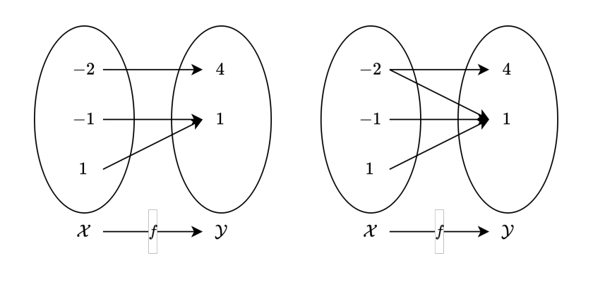

# Introduction
수학은 어떻게보면 수로 이루어진 언어라고 생각합니다. 복잡한 계산은 하지 못해서, 어떤 사람이 쓴 공식을 이해하기 위해 기본적인 표기법과 의미를 알아봅시다.

***

# 함수의 정의
함수는 **입력값을 받아 출력값을 내보내는 규칙**입니다. 이때 입력값에 대응하는 출력값은 하나여야 합니다. 좀더 복잡하게 표현하면 이렇게 할수 있을거 같습니다. 집합 X(정의역, Domain)의 각 원소를 집합 Y(공역, Codomain)의 유일한 원소에 연결하는 규칙을 함수라 합니다.

## Example


왼쪽 함수는 정의역의 원소가 공역의 원소에 하나씩 대응하고 있기 때문에 함수라 할수 있습니다. 하지만 오른쪽 예시는 -2원소가 2개의 원소에 대응하고 있기 때문에 함수가 아닙니다.

## 표기법
```math
y = f(x) for (x \in X, y \in Y)
```

* x: 집합 X의 원소, 입력값(Input), 변수(Variable), 인수(Argument)
* y: 집합 Y의 원소, 출력값(Output)


***

# 확률의 정의
확률에 대해 알아보겠습니다. 먼저 확률에대해 알아보기 이전엔 몇가지 사전 지식이 필요합니다. 사전지식은 다음과 같습니다.

* **시행**: 동일한 조건하에 여러번 반복 가능하며 결과가 우연에 지배돼는 실험 혹은 관찰
    * 주사위 던지기
* **표본공간**: 시행 결과들의 <R>집합</R>
    * 주사위 던지기의 표본공간은 [1, 2, 3, 4, 5, 6]
* **사건**: 표본공간의 <R>부분집합</R>
    * 주사위 던지기에서 2의 배수가 나오는 사건은 [2, 4, 6]
* **근원사건**: 원소의 개수가 한개인 사건
    * 주사위 던지기에서 2가 나오는 사건

## 수학적 확률
확률에는 여러가지 개념이 있지만 가장 먼저 수학적 확률에 대해 알아보겠습니다. 수학적 확률은 한가지 전재가 있습니다. **근원사건이 일어날 가능성이 모두 같을때** 라는 전제조건이 있을때에만 수학적 확률을 계산 가능합니다. 예를들어 주사위 던지기에서 각 면이 나올 확률은 1/6로 모두 같다고 판단한다면 수학적 확률을 계산할수 있습니다. 이때 수학적 확률은 다음과 같이 계산합니다.

```math
P(A) = \frac{n(A)}{n(S)}
```

여기서 P는 Probability의 약자로 확률을 의미합니다. A는 사건을 의미하며, n은 사건의 원소의 개수를 의미합니다. S는 표본공간을 의미합니다. 그리므로 해당 공식은 이렇게 해석할수 있습니다. **사건 A가 일어날 확률은 사건 A의 원소의 개수를 표본공간의 원소의 개수로 나눈 값**입니다. 사건 A를 2의 배수라고 가정하면 다음과 같이 계산할수 있습니다.

```math
P(A) = \frac{n({2, 4, 6})}{n({1, 2, 3, 4, 5, 6})} = \frac{1}{2}
```

## 통계적 확률
아까 수학적 확률을 계산하기 위한 전제조건이 **근원사건이 일어날 가능성이 모두 같을때** 라고 했습니다. 하지만 현실에서는 이러한 전제조건이 성립하지 않을때가 더 많은것 같습니다. 그래서 이러한 경우에는 통계적 확률을 사용합니다. 통계적 확률은 **근원사건이 일어날 가능성이 서로 같지 않을때** 사용됩니다.

이번에는 동전을 던지는 경우를 가정해 보겠습니다. 동전을 생각할때 앞면과 뒷면이 완전히 같은 경우는 거의 없죠? 미세하지만 분명 차이가 있을것입니다. 그러므로 앞면이 나올 확률이 1/2라고 콕 집어서 말하긴 어려울것 같습니다. 그래서 동전을 무한정 던지는 실험을 할겁니다. 그리고 **앞면이 나온 횟수r을 전체 던진 횟수 n으로 나누어 확률을 계산**합니다. 이때 n이 무한대로 가면 실제 앞면이 나올 확률에 가까워집니다.

```math
\lim\limits_{n \to \infty} \frac{r}{n}
```
* n: 총 던진 횟수
* r: 앞면이 나온 횟수

***

# 조건부확률
정의부터 봅시다. 조건부 확률은 이렇게 씁니다. **P(A|B)** 이 뜻은 B라는 사건이 일어났을때 A라는 사건이 일어날 확률을 의미합니다.

그렇다면 계산은 어떻게 할까요? B라는 사건이 일어난 상황에서 A라는 사건이 일어났기 때문에 일단 P(B)를 분모에 놓아야 합니다. 그리고 분자를 생각해보면 B라는 사건이 일어난 상황에서 A라는 사건이 일어날 확률을 구해야 합니다. 즉 **P(A|B) = P(A 교집합 B) / P(B)** 가 됩니다.

```math
P(A|B) = \frac{P(A \cap B)}{P(B)}
```


정의자체는 저렇게 되지만 잘 와닿지 않을수 있습니다. 그래서 예를 들어보겠습니다.

1부터 20까지 적힌 카드 중에서 한장을 뽑는다 생각해 보겠습니다.

A와 B사건을 정의해 보겠습니다.

* A: 3의 배수가 나오는 사건
* B: 2의 배수가 나오는 사건

이때 P(A|B)를 구해보겠습니다. 이때 P(A|B)는 2의 배수가 나왔을때 3의 배수가 나올 확률을 의미합니다.

그렇다면 P(B)의 값부터 구해보겠습니다. 2의 배수가 나올 확률은 10/20입니다.

P(A 교집합 B)를 구해보겠습니다. 2의 배수이면서 3의 배수인 수는 6, 12, 18입니다. 즉 3개입니다. 즉 P(A 교집합 B) = 3/20 입니다.

결과적으로 P(A|B) = P(A 교집합 B) / P(B) = 3/20 / 1/20 = 3/10 입니다.

여기서 잘 살펴보면 분바, 분모에 분모로 20이 들어가게 되는데, 이는 약분을 통해 1이 되는것을 알수 있습니다.

그렇다면 이제 10과 3을 나누면 3/10이 나오게 됩니다. 근데 이떄 10을 잘 살펴보면, 20개의 카드중 2의 배수가 나올 경우의 수입니다. 즉, 카드 20개가 아닌 2의 배수인 카드많을 고려한다는것과 똑같은 의미를 가지게 됩니다. 즉 표본공간이 1부터 20까지가 아니라 2의 배수들많으로 구성된 10장의 카드로 바뀝니다. 즉 조건부 확률이란것은 표본공간이 주어진 환경에 의해 바뀐 상황이구나 라는것을 알수 있습니다.


***


# 이산확률
이떄 이산이라는 뜻은 떨어져있따 라는 뜻입니다. 자연스럽게 이산확률분포는 떨어져있는 확률분포 입니다.

예를들어, 주사위를 던진다 가정해보겠습니다.

이때 눈을 확률변수X라 해보겠습니다.

* 확률변수X - 1, 2, 3, 4, 5, 6

이때 이 1, 2, 3, 4, 5, 6은 떨어져있습니다. 즉 셀수있는 값들입니다. 즉 이산확률분포는 셀수있는 확률변수의 확률분포입니다.

또한 이러한 이산확률분포는 보통 표로 나타내게 됩니다.

| X | 1 | 2 | 3 | 4 | 5 | 6 |
|---|---|---|---|---|---|---|
| P(X) | 1/6 | 1/6 | 1/6 | 1/6 | 1/6 | 1/6 |

확률이란 기호는 P라는 기호를 사용합니다. P(X)는 확률변수 X가 나올 확률을 의미합니다. 즉 x라는 확률변수가 나올 확률 = P(x) 라 표현합니다.

P(1) 이라 하면 1이라는 확률변수가 나올 확률은 1/6이라는 뜻입니다. 모두 더하면 1이 됩니다. 반드시

## 평균
통계에서 가장 중요한 개념중 하나가 평균입니다. 평균은 E(x)라 표현합니다.

평균을 어떻게 구할까요?

변수와 확률을 구해 곱한다음 전부 더하면 됩니다.

코드로 표현하면 이렇게 됩니다. x는 확률변수이고 P는 확률변수 x에대한 확률을 구하는 함수라 이해하면 됩니다.

```python
def P(x):
    return 1/6

def E(P, x):
    return sum([x * P(x) for x in range(x)])
```

## 분산, 표준편차
분산은 V(x)라 표현합니다. 자료, 데이터들이 불규칙하게 분포하는 정도를 나태내는 통계량 입니다. 자료들이 평균값으로부터 얼마나 퍼져 있는가를 가늠해 볼 수 있습니다.

분산을 구하는 공식을 파이썬으로 표현하면 이렇게 됩니다.

```python
def V(x):
    return E(x**2) - E(x)**2
```

표준편차는 분산의 제곱근 입니다. 즉 분산의 제곱근을 구하면 표준편차가 됩니다. 보통 분산은 수치가 너무 크기 때문에 적당히 줄여 쓰는 용도로 사용합니다. 분산은 보통 σ(x)로 표현합니다.

```python
def SD(x):
    return V(x)**0.5
```

***

# 연속확률
연속확률분포는 이산확률분포와 다르게 셀수 없는 연속적인 확률변수의 확률분포입니다. 주사위로 예로 들면 **주사위를 던졌을시 N번 회전할 확률**에서 이 N을 확률변수로 설정해 줄수 있는데요, 이때 확률변수는 이산확률 변수처럼 유한개의 값을 가지는 것이 아니라 연속적인 값을 가질수 있기 때문에 이러한 확률변수를 연속확률변수라 합니다.

이산확률분포와 다르게 연속확률분포는 함수로 나타내게 됩니다. 이때 이 함수를 확률밀도함수라 합니다. 확률밀도함수는 확률변수가 특정 구간에 속할 확률을 나타내는 함수입니다.


***

# 기댓값(Expected Value)
기대값은 어떠한 시행을 무한히 반복했을 때, 평균적으로 얻을 수 있는 확률 변수의 값을 의미합니다.


```math
E(X) = \sum_{i=1}^{n} x_i * P(x_i)
```

## 조건부 기대값


