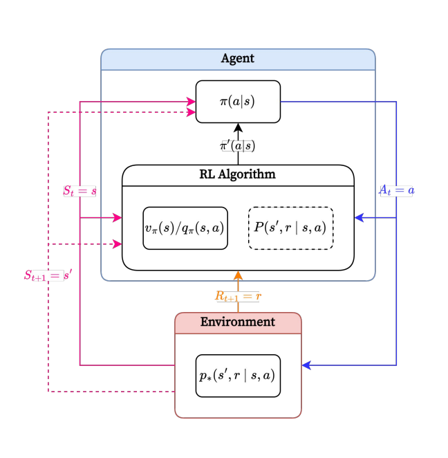

# Reinforcement Learning
배고픈 고양이를 버튼을 눌러야 문이 열리는 특별한 상자에 가두고, 상자 밖에는 먹이를 두었다고 사정해 봅시다. 만약 고양이가 우연히 버튼을 누르게 되면 상자 밖으로 빠져나와 사료를 먹을수 있을겁니다. 이를 반복하게 되면, 고양이는 <R>버튼을 누르는 것이 긍정적인 결과를 낸다</R> 를 학습하고 점점 더 상자에서 빠져나오는 시간이 짧아지게 될겁니다. 이것은, 버튼을 누르는 행동과 긍적적인 결과간의 관계가 강화(Reinforcement)되었다 라고 할수 있습니다. 이것이 바로 강화학습의 기본적인 개념입니다.

이를 위에서 배웠던 용어로 다시 정리해 보겠습니다.
* **에이전트(Agent)**: 고양이
* **환경(Environment)**: 고양이를 제외한 모든것
* **상태(State)**: 고양이가 상자 안에 있는 상황, 상자 밖에 있는 상황 등 현재 환경의 상태
* **행동(Action)**: 버튼을 누르거나, 움직이거나 하는 등 에이전트가 선택할 수 있는 모든 행동들
* **정책(Policy)**: 특정 상태에서 어떤 행동을 선택할지 결정하는 전략 (예: 배고픈 상태에서 버튼을 누르는 행동을 선택)
* **보상(Reward)**: 행동의 결과로 얻는 피드백 (예: 먹이를 먹었을 때의 만족감)

추가적으로 강화학습의의 중요한 핵심적인 특징중 하나는, **버튼을 누르면 왜 문이 열리는가?** 와 같은 원리를 이해할 필요가 없습니다. 대신 **이 상황(상태)에서 이 행동을 했더니 좋은 결과가 났다**라는 사실만 알면 됩니다.


아래 예시로 보여드릴 딥바인드에서 만든 게임 AI는 화면, 점수, 오른쪽 왼쪽밖에 모른다고 합니다. 이 AI는 화면에서 어떤 행동을 해야 좋은 결과를 얻는지를 학습하게 됩니다. 아래 예시에선 왼쪽, 오른쪽 밖에 없는 간단한 상황이지만, 운전시 핸들을 어떻게 돌려야 하는지 같은 각도 같은 연속적인 이러한 경우는 훨씬 어렵기 때문에 100000번, 20000번 시도해 우연히 성공하듯 학습하게 됩니다. 추가적으로 알파고 제로 또한 바둑이 뭔지 모르는 상태에서 학습을 시작합니다.

## Characteristics: Optimalization
강화학습은 최대의 보상을 얻을수 있는 최적의 정책을 학습하는 것이 목표 입니다.
예를들어, 체스에서는 승리하는 것이 최대의 보상이 될겁니다. 혹은 최단거리로 미로를 빠져 나가는 경로를 찾는 경우도 있을수 있거요.

주요한 특징은, 현재 선택한 행동에


## 특징: 최적화
기본적으로 강화학습은 최적화를 푸는 문제

중요한거 어떤 가치가 있는지 명시적으로 표표현된다.

가와학습의 모델은 옭고 그름을 알지 못하고 어떤 보상상이 주어지는지다.

## 순차적
직관적으로 당연

## Delayed Consequences

체스를 예로들면 지금의 수가 당장은 손해더라도 끝까지 갔을때때의 보상이 큰 행도을 학습(승리)

## Exploration
손 했을때 손을 물었을때, 손으 올렸다면 머기가 주어졌단 사실을 모름(대부분)

***

# WhereReinforcementLearning?
* 최적의정책을인간이알수없는경우
    * 예.인간의능력을뛰어넘는최적의정책을찾기(AlphaGoZero등)
    * 예.기존에알려지지않은분야에서최적의정책을찾기(핵융합로플라즈마 제어 등)

* 현재시점에서선택된행동의(최종적인)결과를나중에라도알수있는 경우
    * 예.AtariBreakout:점수
    * 예.체스나바둑:승패여부

***

# Workflow
Workflow를 보기 전 알아두어야 할점은 상태 하나하나 시간이 존재한다는것입니다.



순서대로 살펴보겠습니다.
1. 강화 학습 Agent는 환경의 상태를 인지 합니다.
    * **Environment -> Agent:** $S_{t} = s$
2. 정책을 바탕으로 인지된 상태에 대한 행동을 선택
    * $\pi(a | s)$ -> $A_{t} = a$
3. 환경은 선택된 행동에 대해 보상을 에이전트에게 제공하고, 새로운 상태로 변경, 마치 바둑돌을 두면 환경이 변화 하는것과 같습니다.
    * $R_{t + 1} = r$, $S_{t + 1} = s'$
4. 상태-행동-보상을 참고하여, 현재 정책의 가치를 평가하고 더 나은 정책을 학습
    * $v_{\pi}(s)$ / $q_{\pi}(s, a)$


요약: 어떤 관측한 상태에서 어떠한 행동을 하면 보상이 주어지고(양수, 음수 다 가능), 상태를 변화하고 업데이트

## 에이전트
환경과 상호작용하면서 주어진 목적을 달성할 수 있는 최적의 정책을 학습하는 주체 입니다. 학습된 정책을 바탕으로 주어진 상태에 대한 행동을 선택하고, 보상을 받습니다.


## 환경
Agent와 상호작용 하되, Agent에 포함되지 않는 모든것을 의미합니다. Agent가 취하는 행동의 결과인 보상을 제공하며, 자신의 상태를 Agent에게 드러냅니다.

현실의 문제에서 환경을 전부 파악하는 경우는 거의 불가능에 가까우므로, Agent에게 드러내는 환경은 실제 환경과 다를수 있습니다.

## 상태
```math
S_{t} = s
```
Agent가 관측할 수 있는 정보를 바탕으로 인지된 환경의 상태를 의미합니다. 실제 환경의 상태와 Agent에 의해 인지된 상태는 (보통) 같지 않으나, 많은 경우 같다고 가정합니다.

## 행동
```math
A_{t} = a
```
학습된 정책에 기반하여, 주어진 상태에서 선택한 의사결정을 의미합니다. Agent가 환경에게 전달하는 유일한 정보입니다.

행동은 이산적인 경우와 연속적인 경우로 나뉩니다. 이산적인 경우는 Breakout의 좌우 이동, 연속적인 경우는 앵그리버드의 발사 각도 조절이 있습니다.

## 보상
```math
R_{t + 1} = r
```
Agent가 환경에게 받는 피드백을 의미합니다. Agent가 선택한 행동에 대한 결과로 주어지며, 보상은 양수, 음수, 0 등 Scalar Value로 주어집니다.

예를들어, 체스말을 잃었을때 -1, 안잃었으면 0, 얻었으면 +1 인 경우가 있습니다.

또 ,트럭 시뮬레이션의 경우 시간당 -1을 주어진다면 빠르게 하는데에 집중해 모든 오브젝트에 박아대면서 주차할 수 있습니다.

어떤 예에선 게임 AI가 -1을 받지 않기 위해 승리(+1) 보다 게임을 멈추는 방법(0) 을 학습했다.

이러한 적절한 보상의 설게가 RL의 주요한 난제 입니다.

## 정책
상태를 입력으로, 출력을 행동으로 하는 함수로, 주어진 상태에 대한 Agent의 행동을 결정합니다.

### 결정론적 정책(Deterministic Policy)
```math
a = \pi(s)
```
결정적 정책에선 동일한 상태에 대해 동일한 행동을 하는 정책을 의미합니다.

### 확률적 정책(Stochastic Policy)
```math
\pi(a | s)
```
상태에 대해 행동을할 확률을 출력으로 내는 정책을 의미합니다. 이는 동일한 상태에 대해 여러 행동을 선택할 수 있습니다.


## 수익(return)
```math
G_{t} = R_{t} + {\gamma}R_{t + 1} + {\gamma}^2R_{t + 2} + {\gamma}^3R_{t + 3} + \cdots
```
현재 시점부터 미래까지 받을 수 있는 보상의 누적합을 의미합니다. $\gamma$는 0 ~ 1값을 가지며 할인율을 의미합니다. 미래의 보상이 현재의 보상보다 얼마나 중요한지를 결정합니다. 현재 시점에 가까울 수록 보상의 가치가 크게 됩니다.

강화학습의 Agent는 Return을 최대화 하는것을 목적으로 학습합니다. 정확히는 Expected Return을 최대화 하는것을 목적으로 합니다.

왜 Explected Return 이냐면, state와 action이 random variable이기 때문에, 어떤 행동을 했을때 어떤 보상또한 ranom variable이기 때문입니다.


## 가치 함수(Value Function)
정책의 가치를 평가하는 함수를 의미하고 2가지 종류가 있습니다. 가치란 특정 상태에서 얻을 수 있는 수익의 기대값을 의미합니다.

### 상태 가치 함수(State Value Function)
```math
v_{\pi}(s) = E_{\pi}[G_{t} | S_{t} = s]
```
정책이 주어 졌을때, 주어진 상태에서 얻을 수 있는 수익의 기대값을 의미합니다.

### 행동 가치 함수(Action Value Function)
```math
q_{\pi}(s, a) = E_{\pi}[G_{t} | S_{t} = s, A_{t} = a]
```
정책이 주어졌을때, 주어진 상태와 행동에서 얻을 수 있는 수익의 기대값을 의미합니다.

## 모델(Model)
```math
P(s', r | s, a) = P(S_{t + 1} = s', R_{t + 1} = r | S_{t} = s, A_{t} = a)
```
이전에 실제 환경과 Agent에게 드러난 환경이 다르다고 했습니다. Model은 주어진 상태에서 Agent가 내린 행동에 대해, 환경의 다음 반응(보상 및 다음 상태)를 예층하는 함수 입니다.

오직 관측된 정보를 바탕으로 추정하며, 실제 환경과 다를 수 있습니다. 또 Model은 RL Agent를 학습시키는 데 필수적인 요소는 아닙니다.

