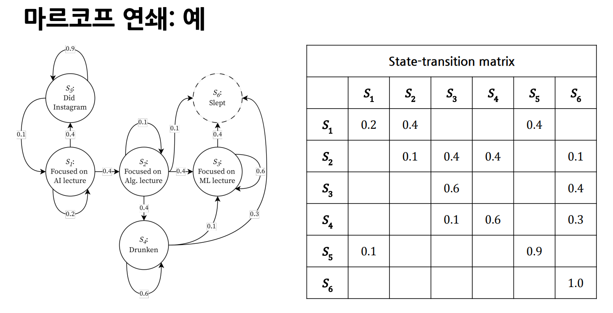

# 확률 프로세스(Stochastic Process)
확률 프로세스란 시간에 따라 발생한 확률변수들의 순차적 모임을 뜻합니다.

```math
X_1, X_2, X_3, \cdots, X_t
```

또한 다음 사건이 발생할 확률은 현재까지 발생했던 사건들이 발생할 결합확률을 조건으로하는 조건부 확률로 표현 됩니다. 이는 다음 사건이 발생할 확률을 알기 위해서는 이전에 발생한 사건들의 발생 확률을 모두 기억해야 함을 의미하기도 합니다. 수식으론 다음과 같이 나타낼 수 있습니다.

```math
P(X_{t+1} | X_1, X_2, X_3, \cdots, X_t)
```
***

# 마르코프 성질(Markov Property)
확률 프로세스에서 다음 사건이 발생할 확률이 오직 현재 사건에만 의존적이라고 가정하는 성질을 의미합니다. 이전에 발생한 사건들의 발생 확률을 기억할 필요 없이 현재 사건에만 집중하면 되는 특징이 있습니다. 대다수의 강화 학습 문제는 마르코프 성질을 따르는 확률 프로세스로 표현됩니다.

```math
P(X_{t+1} | X_1, X_2, X_3, \cdots, X_t) = P(X_{t+1} | X_t)
```


## 마르코프 연쇄(Markov Chain)
ref: https://roytravel.tistory.com/358

상태와 상태 전이 확률(State-Transition Probability)로 이루어진 Tuple로 정의되며, 마르코프 성질을 따르는 확률 프로세스를 의미합니다.



## 마르코프 결정 프로세스(Markov Decision Process, MDP)
마르코프 연쇄에는 현재의 상태와 다음 상태로 이동하는 상태 전이 확률로 이루어진 튜플 이였습니다.
Markov Decision Process, 줄여서 MDP는 마르코프 연쇄에 행동(Action)과 보상(Reward), 할인율이 추가된 튜플로 정의 됩니다.

```math
<S, A, R, P, \gamma>
```
* S: a set 0f states, [$s_1, s_2, s_3, \cdots$]
* A: a set of actions, [$a_1, a_2, a_3, \cdots$]
* R: a set of rewards, [$r | r \in R$]
* P: a set of state-trans. prob., where
    * TODO: 공식 몬지 모르겠음
* $\gamma$: a discount rate, [$\gamma \in (0, 1]$]


## MDP와 RL
RL을 통해 해결하려는 문제는 MDP로 정의됩니다. 따라서, RL을 통해 문제를 해결하기 위해서는 상태, 행동, 보상, 상태 전이 확률, 할인율이 정의되어야 함을 의미합니다. 요약해, 강화학습이란 곧 MDP를 푸는 것이라고 할 수 있습니다.

