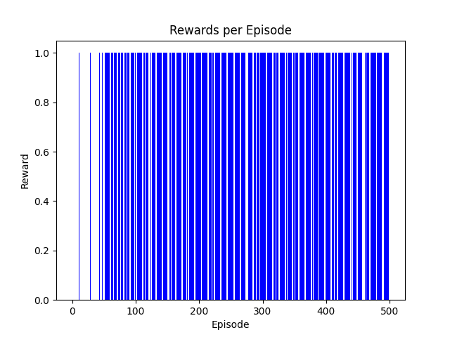

https://dryjelly.tistory.com/138

# 소개
이전에 공부했던 Q-network를 Frozen Lake에 적용해 보겠습니다. 하지만 여러분들도 알다 싶이 Frozen Lake는 굉장히 쉬운 문제입니다. 이 문제를 해결하기 위해 NN을 적용한다는것은 마치 사과를 깎기 위해 팔뚝만한 중식도를 사용하는것과 같습니다. 그저 이해를 돕기 위한 코드란 점을 감안해 주세요.

코드응 pytorch 를 사용합니다.


전체 코드
```python
import gymnasium as gym
import numpy as np
import torch
import torch.nn as nn
import torch.optim as optim
import matplotlib.pyplot as plt

class QNetwork(nn.Module):
    def __init__(self, input_size, output_size):
        super(QNetwork, self).__init__()
        self.layer1 = nn.Linear(input_size, output_size)

    def forward(self, x):
        return self.layer1(x)

class DQNAgent:
    def __init__(self, input_size, output_size, learning_rate=0.1, gamma=0.99):
        self.device = torch.device("cuda" if torch.cuda.is_available() else "cpu")
        self.q_network = QNetwork(input_size, output_size).to(self.device)
        self.optimizer = optim.SGD(self.q_network.parameters(), lr=learning_rate)
        self.gamma = gamma

    def get_action(self, state, epsilon):
        with torch.no_grad():
            state_tensor = state.to(self.device)
            q_values = self.q_network(state_tensor.unsqueeze(0))  # Batch 추가
            if np.random.random() < epsilon:
                return np.random.randint(q_values.size(-1))
            return q_values.argmax().item()

    def train_step(self, state, action, reward, next_state, done):
        state_tensor = state.to(self.device)
        next_state_tensor = next_state.to(self.device)

        # 현재 Q 값 계산
        current_q_values = self.q_network(state_tensor.unsqueeze(0))  # Batch 추가
        q_value = current_q_values[0, action].unsqueeze(0)  # 차원 추가

        # 타겟 Q 값 계산
        with torch.no_grad():
            next_q_values = self.q_network(next_state_tensor.unsqueeze(0))  # Batch 추가
            max_next_q = next_q_values.max(1)[0]
            target = torch.tensor([reward + (1 - done) * self.gamma * max_next_q], device=self. device)  # 크기 맞추기

        # 손실 계산 및 최적화
        self.optimizer.zero_grad()
        loss = nn.MSELoss()(q_value, target)
        loss.backward()
        self.optimizer.step()

        return loss.item()

'''
Converts an state (int) to a tensor representation.
For example, the FrozenLake 4x4 map has 4x4=16 states numbered from 0 to 15.
Parameters: state=1, num_states=16
Return: tensor([0., 1., 0., 0., 0., 0., 0., 0., 0., 0., 0., 0., 0., 0., 0., 0.])
'''
def one_hot(state: int, num_states: int) -> torch.Tensor:
    input_tensor = torch.zeros(num_states)
    input_tensor[state] = 1
    return input_tensor

def train():
    env = gym.make('FrozenLake-v1', is_slippery=False)
    input_size = env.observation_space.n
    output_size = env.action_space.n
    num_episodes = 500
    print(f"input_size: {input_size}, output_size: {output_size}")
    agent = DQNAgent(input_size, output_size)
    rewards_history = []

    for episode in range(num_episodes):
        state = env.reset()[0]
        state = one_hot(state, input_size)

        epsilon = 1.0 / ((episode / 50) + 10)
        episode_reward = 0
        done = False

        while not done:
            action = agent.get_action(state, epsilon)
            next_state, reward, done, _, _ = env.step(action)
            next_state = one_hot(next_state, input_size)

            loss = agent.train_step(state, action, reward, next_state, done)
            episode_reward += reward
            state = next_state

        rewards_history.append(episode_reward)

    return rewards_history

if __name__ == "__main__":
    rewards_history = train()
    success_rate = sum(rewards_history) / len(rewards_history) * 100
    print(f"Success rate: {success_rate:.2f}%")

    plt.bar(range(len(rewards_history)), rewards_history, color="blue")
    plt.xlabel("Episode")
    plt.ylabel("Reward")
    plt.title("Rewards per Episode")
    plt.savefig("Q-network-FrozenLake.png")
```

**OUTPUT**


***
질문 리스트

1. 원핫 인코딩의 장점?
2. FrozenLake는 2차원 평면에서 이루어지는 게임이지만 해당 코드는 플레이어만 1로 표현하게 되는데, 결과가 나쁘지 않다, 이는 고정된 맵이기 때문에 특정 지역에 가면 안된다는것을 선형레이어로만으로도 학습이 되기 때문인가?
3. 콘볼루션 레이어는 2차원 데이터를 파악하기 쉬운 레이어라고 알고 있는데, 이때 input에 해당하는 데이터는 굳이 RGB, 흑백 이미지 데이터가 아니라 임의적으로 선언한 1부터 N까지 숫자를 매핑해줘도 될까?
4. 만약 된다면 1부터 N까지의 정수가 아닌 0.0부터 1.0까지의 숫자로 매핑해주는게 더 좋다는데 맞나?
5. 2번 과제에서 멀티프레임을 적용시켰는데, 이를 사용한 근거는 단일 프레임으론 Agent의 움직임을 파악하기 힘들거 같아서 2프레림의 데이터를 중첩시켜서 사용했다, Atari 게임 논문에서도 4Frame의 데이터를 사용했는데 이는 Agent과 환경의 움직임을 파악하기 위함이라 해석했는데 그냥 단일 프레임으로 하면 시간이 너무 오래걸려선가?
6. 카트폴 문제에선 환경에 대한 정보 없이 오로지 Agent의 데이터로만 학습을 진행했다(각도, 속도). 이는  외부 환경이 변하지 않기 때문이라 그런거 같은데, 환경이 변화하는 게임에서도 이러한 방식으로 학습을 진행할 수 있을까? 예를들어 꿀벌들의 위치, 말벌들의 위치, 내 위치, 내 방향 등등을 콘볼루션이 아닌 선형 레이어에 넣어서 학습을 진행한다면?
7. 보상을 과도하게 준다면 학습이 빠르게 진행되지만 안정성이 떨어지고, 너무 적게준다면 학습이 느리게 진행되고, 너무 복잡하게 줘도 학습이 안될수도 있고.. 최대한 심플하게 줘야 하는건가?
8. 보상이 너무 커서 불안정해 지는걸 막기 위해 `torch.nn.utils.clip_grad_norm_(self.policy_net.parameters(), 1.0) # 클리핑` 이런식으로 클리핑 시켰는데 이러면 이제 안정성을 확보하면서 학습을 빠르게 징행할수 있을까?