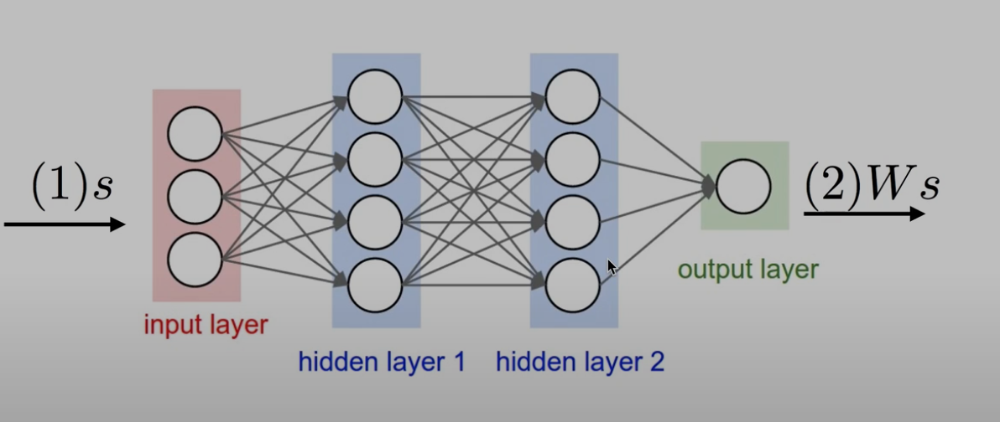
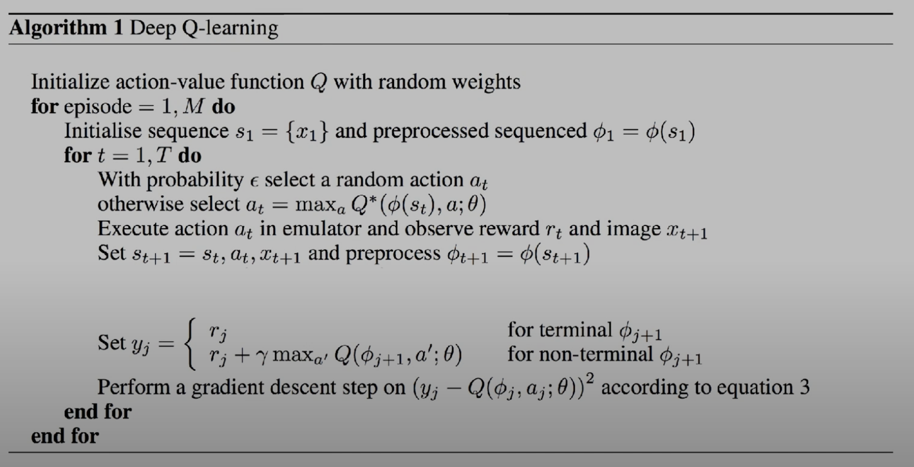

# Q-Network

이번 강의에선 Q-Network를 사용해 RL을 구현해 보겠습니다. 지난시간까지 했던 방식으론 Q-table를 통해 Q-learning을 학습하는 방법에 대해 완벽히 학습했다고 해도 과언이 아닙니다.

하지만 Q-table을 가지고 실제 세상의 문제를 해결할수 있을까요? 흠.. 글쎄요 만약 체스를 하는 강화학습 Agent를 만든다 해서 Q-table 방식을 가지고 만든다면 체스만 하더라도 기존의 Q-learning 같은 방식으론 전세계의 하드웨어를 끌어와야 할것입니다. 그러므로 이젠 다른 방식을 사용해야 합니다. 사실상 불가능하다 할수 있겠습니다.

그래서 사람들이 생각한 Network 방식입니다.

보통 Network 라고 하면 Newerl Network를 칭한다 생각하면 됩니다.

어떤 state와 action을 입력으로 주면 output으로 Q-value를 출력하는 Network 을 생각해 볼수 있을겁니다.

사실 NN은 매우 무거운 작업이긴 하지만 적어도 Q-table 보단 적은 메모리를 사용하고 더 빠르게 학습할수 있습니다.

혹은 state만 입력을 주고 output은 action 을 출력하는 Network를 만들수도 있습니다.

## Training (linear regression)
이제 뭔가 될것만 같은 느낌이 드는데 잠시 Linear regression에 대해 복습해 보겠습니다.



어떤 s가 네트워크(w) 거쳐 통과하면 $Ws$ 라는 결과가 나오게 됩니다. 이때 $W$는 weight를 의미합니다. 이때 이 $Ws$ 를 우리가 원하는 $Q$ 값으로 만들어 주는 것이 목표입니다.

이를 수식으로 나타내면 다음과 같습니다.

$H(x) = Wx$

이때

$cost(W) = \frac{1}{m} \sum_{i=1}^{m} (H(x^i) - y^i)^2$

이 수식을 Q-learning에 적용하면 다음과 같습니다.

이전 까지의 수식을 다시 한번 살펴보면 다음과 같습니다.

$Q(s, a) = r + \gamma \max Q(s', a')$

이 수식은 현재 state s에서 action a를 취했을때 r와 미래의 reward를 합친것으로 업데이트 하겠단 의미입니다. 그리고 이전시간에 말했다 시피 Q-learning 에선 이 $r + \gamma \max Q(s', a')$ 을 Optimal 하다 가정합니다. 그러므로 이는 $Q^*$ 라고 표현할수 있습니다.

그러므로 다시 정리하면 $cost$ 함수는 다음과 같이 정리할수 있습니다.

$cost(W) = (Ws - y)^2$

즉 Network로부터 나온 $Ws$를 $Q^*$와 같도록 만들어 주는 것이 목표입니다.

## Math notations
이 예기를 다시 정리해 좀더 formal한 형태로 예기해 보겠습니다.

TODO: 아래 문장은 클로드가 말해줬지만 한번더 검증할 필요가

이전에 계속 $Ws$ 라느 게속 예기했지만 이제부턴 $\hat{Q}(s,a | w)$ 라고 부르겠습니다. 이는 주어즌 s와 a에 대한 Q-value를 w라는 weight를 가진 Network로부터 나온 값이라는 의미입니다.

이를 $Q^*(s,a)$ 와 같도록 만들어 주는 것이 목표입니다.

정리하면

```math
\hat{Q}(s,a | w) \approx Q^*(s,a)
```

이 수식이 바로 우리의 목적이라 할수 있습니다. 그렇다면 어떻게 같아지게 할수 있을까요? 밑에서 이어서 하겠습니다.

### Choose $W$ to minimize
```math
\min_{\theta} \sum_{t=0}^T [\hat{Q}(s_t, a_t|\theta) - (r_t + \gamma \max_{a'}\hat{Q}(s_{t+1}, a'|\theta))]^2
```

이 수식에서 $\hat{Q}(s_t, a_t|\theta)$ 은 Network로부터 예측된 Q-value 이고, $(r_t + \gamma \max_{a'}\hat{Q}(s_{t+1}, a'|\theta))$ 는 이전까지 계속 했던 &Q^*$ 값이라 할수 있습니다. 이전에 배웠던 linear regression와 같은 수식입니다.

***

# Algorithm
이제 이론이 아니라 이것을 어떻게 코드로 규현할수 있을지 알아보겠습니다.

알고리즘이라 부르고 한줄한줄 빡빡하게 써져 있지만 한줄한줄 읽어보면 사실 별거 아닙니다. 지금까지 했던 말을 이 한장으로 정리한것이라 할수 있습니다.

**Playing Atari with Deep Reinforcement Learning - University of Toronto by Mnih et al.**



1. **Initialize action-value function Q with random weights**
    * 이는 Network를 초기화 하는 것입니다. 이때 Network는 random한 weight를 가지게 됩니다.
2. **Initialise dequence $s_1 = {x_1}$ and preprocessed sequenced $\phi_1 = \phi(s_1)$**
    * 루프 내에서 $s_1 = {x_1}$ 첫번째 상태를 가져온다는 뜻입니다. 그리고 이 받아온 상태를 가지고 Network에 넣기 위해 전처리를 해줍니다. 이를 기호로 $\phi_1 = \phi(s_1)$ 라고 표현합니다.
3. **With probability $\epsilon$ select a random action $a_t$ otherwise select $a_t = \max_a Q^*(\phi(s_t), a; \theta)$**
    * 이는 $\epsilon$ 확률로 랜덤한 action을 선택하거나, Network로부터 나온 Q-value중 가장 큰 값을 선택한다는 뜻입니다. 이전엔 이해를 위해 익숙한 기호인 $W$ 를 사용했지만 여기선 $\theta$ 라고 표현합니다.
4. **Execute action $a_t$ in emulator and observe reward $r_t$ and image $x_{t+1}$**
    * 이는 선택한 action을 실행하고, 그에 대한 reward와 다음 상태를 받아오는 것입니다. 해당 논문에선 이미지를 통해 학습했기 때문에 image 라는 단어를 사용합니다.
5. Set $y_j = \begin{cases} r_j & \text{for terminal }\phi_{j+1} \\ r_j + \gamma \max_{a'} Q(\phi_{j+1}, a';\theta) & \text{for non-terminal }\phi_{j+1} \end{cases}$, Perform a gradient descent step on $(y_j - Q(\phi_j, a_j;\theta))^2$ according to equation 3
    * 이부분이 바로 학습하는 부분으로 핵심이라 할수 있습니다. 다음 섹션에서 자세히 다루겠습니다.

## 학습
Set $y_j = \begin{cases} r_j & \text{for terminal }\phi_{j+1} \\ r_j + \gamma \max_{a'} Q(\phi_{j+1}, a';\theta) & \text{for non-terminal }\phi_{j+1} \end{cases}$, Perform a gradient descent step on $(y_j - Q(\phi_j, a_j;\theta))^2$ according to equation 3

해당 의사 코드를 좀더 자세히 살펴보겠습니다.

이전에 했던 Q-learning의 수식과 거의 일치합니다.

terminial 이란 의미는 한 에피소드가 끝났다는 뜻입니다. 이는 agent가 게임을 클리어 했을때를 의미합니다. 이때는 $y_j = r_j$ 가 됩니다.

만약 클리어를 하지 않고 그 중간인 상태라면 $y_j = r_j + \gamma \max_{a'} Q(\phi_{j+1}, a';\theta)$ 가 됩니다. 이는 이전에 했던 Q-learning의 수식과 같습니다. 지금 현재의 보상과 미래의 보상을 합친것의 최대값을 discount factor $\gamma$ 만큼 곱한것을 의미합니다.

Perform a gradient descent step on $(y_j - Q(\phi_j, a_j;\theta))^2$ according to equation 3

이것이 바로 loss function 라 할수있는데 매우 간단합니다. $Q(\phi_j, a_j;\theta)$ 이것은 Network에서 예측하는 값입니다. $\hat{Q}$ 과 같습니다. 이 값을 target/label 값인 $y_j$ 와 비교하여 최소화 하는 것을 찾아라는 의미입니다. gradient descent 라고도 합니다.

이것이 바로 네트웤을 학습시키는 핵심적인 알고리즘을 정리한것입니다.

제목을 보면 딥마인드 팀에서 아타리게임을 학습시킨 의사코드입니다.

## Learning rate
TODO: learning rate를 쓰지 않는 이유를 적어야 할까? 필수로 알아야 하는것은 아닐듯 한데

## Convergence
마지막 질문은 이겁니다. $\hat{Q}$ 는 결국 실제 목표로 했던 $Q^*$ 와 같아질수 있을까요? 이것은 불가능 합니다. 정확히 말하면 Table 형태에선 수학적으로 가능하다는것이 증명 됐지만 NN을 사용하면 diverges 하게 됩니다. 분산된단 뜻입니다. 이는 학습이 잘 되지 않는다는 뜻입니다.

TODO: 왜 분산돼는지에 대한 링크 필요

NN과 RL을 합치는 방법은 최근에 고민한 방법이 아닙니다. 예전부터 계속 고민했던 문제입니다. 이 문제를 해결한 분들이 딥마인드 팀의 DQN 알고리즘을 만들었습니다.