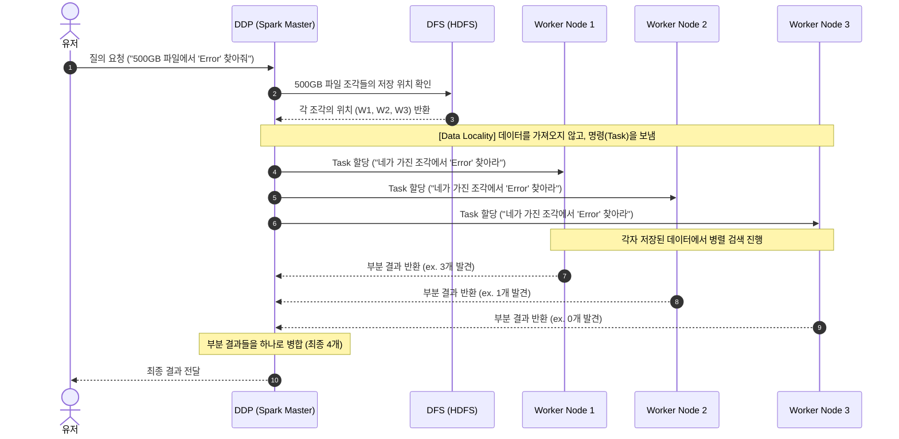

## What is DB?
* **Database:** Organized collection of data
* **DBMS(Database Management System):** `end-user`, `Application`, `Database` 와 상호작용 하는 소프트웨어, 데이터를 캡쳐하거나 분석하는것을 목적으로 둠

## 데이터 포맷
Database 는 **Structured Data** 를 집중으로 발전하여 왔으며, 현대에는 **Semi-Structured Data** 와 **Unstructured Data** 까지 포함하는 다양한 데이터 포맷을 포함하며 점점 확장되어 가고 있다.

### Structured Data
전통적인 Database 로서 **행(row)** 과 **열(column)** 로 이루어진 일종의 **표(Table)** 형태로 데이터를 표현하는 방식이다. `Excel` 이나 `CSV` 가 대표적인 예시, 추가로 `Relational Data` 도 이에 해당한다.

Alice 와 Bob 이라는 학생의 취미를 담은 `Relational Data` 의 예시를 들어보자.

**Students Table**
| Student | ID |
|---------|----|
| Alice   | 1  |
| Bob     | 2  |

**Participants Table**
| ID |  Activity  |
|----|------------|
| 1  | Basketball |
| 1  | Game       |
| 2  | Game       |

### Semi-Structured Data
**Table 구조를 따르지 않는 Structured Data** 를 의미한다.

`XML` 이나 `JSON` 과 같이 구조화된 요소와 자유로운 텍스트가 혼합된 데이터 포맷을 생각하면 된다. 일종의 **Rule 이 존재하는 데이터**

Data Structure 시간에 지겹게 배운 `Graph=(V, E)` 도 이에 해당한다.

아래는 `key-value` 쌍으로 이루어진 `JSON` 포맷의 Semi-Structured Data 예시

```json
{
  "students": [
    {
      "name": "Alice",
      "id": 1,
      "activity": [ "Basketball", "Game" ],
    },
    {
      "name": "Bob",
      "id": 2,
      "activity": [ "Game" ],
    }
  ]
}
```

### Unstructured Data
**어떠한 Rule 이 존재하지 않는 데이터 포맷** `.pdf`, `.jpg`, `.mp4` 같은 **Binary** 데이터가 대표적인 예시, 지금 보는 **줄글**도 Unstructured Data 의 한 예시라고 할 수 있다.

## What if data does not fit in memory? / secondary storage?
현대 산업에선, 한대의 컴퓨터로 처리할 수 없는 방대한 양의 데이터가 생성되고 있다. 자연스럽게 기존 Algorithm 들을 Scalable 하게 설계해야 하는 필요성이 대두되었다.

> **Scalable:** 더 큰 data 에서도 문제없이 수행 가능한 Algorithm 을 의미, Scalable 한 Algorithm 을 설계하기 위해 여러 테크닉 들이 존재한다.

Exploit all hardware resources at the same time
* **Macro parallelism:** cluster 에서 병렬적으로 처리하는 방식
  * **Cloud Computing:** Distributed computing resources (e.g., AWS, Google Cloud)
  * Infiniband
* **Micro parallelism:** 한 컴퓨터 내에서 병렬적으로 처리하는 방식
  * Multi-core CPU
  * Parallel I/Os
  * NUMA

> **Cluster:** 여러 대의 컴퓨터가 네트워크로 연결되어 하나의 시스템처럼 동작하는 환경

## What is Big Data?
> Big data refers to **data sets** that are **too large** to be **dealt with by traditional DBMS.**

이러한 Big Data 는 **4Vs** 라고 불리는 특징들을 가지고 있다.

1. **Volume**: 데이터의 사이즈
2. **Velocity**: 빠른 데이터의 생성 속도
3. **Variety**: 데이터의 다양한 포맷, Structured, Semi-Structured, Unstructured 모두 포함
4. **Veracity**: **부정확**하거나, **불완전**한 데이터가 포함될 수 있다.

### Volume
> Measure describing the size of generated data

* Google web index: `10+ PB`
* Meta's daily logs: `60 TB`

오늘날은 `ZB` 단위까지 산업에서 다루어 지고 있음

### Velocity
> Speed at which the data is generated and processed

이렇게 방대한 데이터는 Youtube, Instagram, Netflix 와 같은 기업들에서 사용자들이 생성하는 데이터, IoT 센서에서 생성되는 데이터, 금융 거래에서 생성되는 데이터 등 다양한 출처에서 생성된다.

### Variety
> Diverse formats of data: structured, semi-structured, unstructured

* **Structured:** `Relational databases`, `CSV files`, `Excel sheets`
* **Semi-Structured:** `JSON`, `XML`, `Graph data`
* **Unstructured:** `Text documents`, `images`, `videos`, `audio files`

### Veracity
> Measure of how truthful, accurate, and reliable data is

데이터의 신뢰성, **실제로 특정 테이블의 특정 벨류들이 빠져있는 경우가 있을 수 있다.** 예를들어 설문조사를 하는데 특정 질문에 답을 하지 않은 경우나, 유저가 올바르지 않은 정보를 입력하는 경우가 있을 수 있다.

어떻게 **부정확한 데이터를 어떻게하면 올바른 값으로 추정**할건가, 라는것도 Big Data 분야에서 중요한 문제, 이런 문제를 풀기 위해 최근에는 머신러닝을 활용하는 경우도 많다.

## Distributed File System
방대한 데이터를 저장하기 위해 여러 Node 에 데이터를 분산하여 저장하는 시스템이 필요하다. 대표적으로 **Hadoop Distributed File System(HDFS)** 이 있다.

가령 한 File 이 500GB 라면, 100GB 씩 5개의 조각으로 나누어서 5개의 Node 에 분산하여 저장하는 방식으로 생각하면 된다.

실제로 Youtube나, Netflix 같은 기업들은 한 동영상 파일을 단일 Node 에 저장하지 않고, **여러 Node 에 분산하여 저장**한다. 단일 Node 에 저장하는 경우에 비해 **데이터의 안정성과 접근 속도가 향상**되기 때문

* 한 노드가 사용 불가능 하더라도 다른 노드에서 데이터 접근 가능
* 여러 노드에서 병렬적으로 데이터에 접근할 수 있기 때문에 빠른 데이터 처리 가능

이러한 DFS 에는 **Replication** 이라는 기능을 반드시 제공해야 하는데, 가령 한 Node 가 화제나, 정전으로 멈췄을때, 파일이 손상되지 않도록 **같은 파일들을 두대 이상의 Node 에다가 복사하는 기능**이다.

완전히 동일한 파일을 복사하지는 않고 여러 기술을 통해 1.8배 정도의 저장 공간만 추가로 사용하면서도 데이터의 안정성을 보장할 수 있는 방법들이 존재한다.

> Node = 컴퓨터

## Distributed Data Processing
DFS 가 여러 Node에 걸쳐 Read, Write, Replication 과 같은 기능을 제공하는 시스템이라면, **Distributed Data Processing 은 여러 Node 에 걸쳐 저장된 파일들에 필터링, 검색, 통계 등 연산과 처리 기능을 제공하는 시스템**이다. 대표적으로 **Apache Spark** 가 있다.

유투브에 비유하면 동영상 업로드와 시청은 DFS 의 기능에 해당하고, **동영상 검색, 추천, 통계 분석 등은 DDP 의 기능**에 해당한다.

Apache Spark 가 Query 를 하면, 한 Node 에서 데이터를 처리하지 않고, 분산된 **각 Node 에 Task 를 할당하여 병렬적으로 데이터를 처리하는 방식으로 동작**한다. Task 를 받은 **각각의 Worker Node 들은** 자신이 저장하고 있는 파편화된 데이터에서 **Task 에 해당하는 연산을 수행**하여 결과를 만들어 낸다. 마지막으로 Query 를 보낸 **User 의 System 에 결과를 모아** 전달하는 방식으로 동작한다.

1. 유저가 500GB 파일에서 Error 라는 단어를 찾기위해 **Spark 에 질의**
2. **Spark 는** DFS(HDFS) 에서 500GB 파일을 여러 Node 에 분산하여 저장된 것을 확인, **위치 파악**
3. **Spark 는** 데이터를 가져오는 대신, Worker Node 1, 2, ... 에게 Error 라는 단어를 찾는 **Task 를 할당**
4. 각 Worker Node 는 자신이 저장하고 있는 데이터에서 Error 라는 단어를 찾아서 결과를 **Spark 에 전달**
5. **Spark 는** 각 Worker Node 들로부터 받은 **결과를 모아서 유저에게 전달**



## 본 수업의 목표
1. Understand and apply big data processing techniques
2. Acquire advanced database and application development skills
3. Strengthen your ability to process large-scale data using Apache Spark and Python
4. Practice data cleaning and transformation methods in hands-on sessions
5. Reinforce theoretical concepts through practical exercises and real-world tasks

별도의 교과서는 사용하지 않는다
