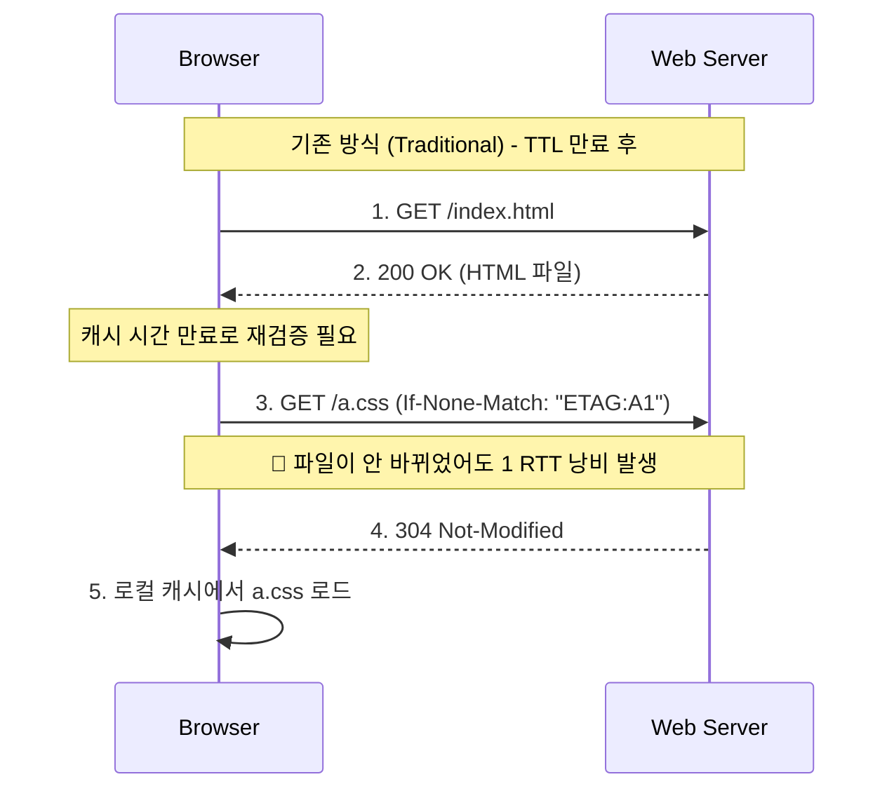
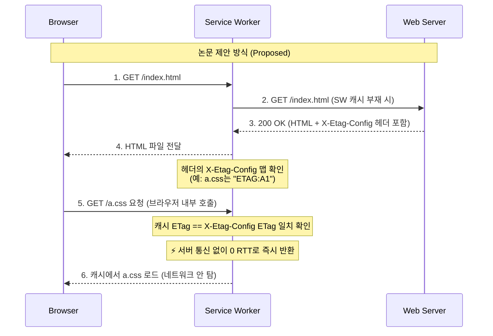

> [Rethinking Web Caching: An Optimization for the Latency-Constrained Internet](https://dl.acm.org/doi/10.1145/3696348.3696873)

## 문제제기
기존의 `max-age` 나 `ETag` 기반의 Web Cache 는, 과거 인터넷 속도가 느릴때 만들어진 기술로, 현대 인터넷 환경은 완전히 달라졌다는 점에서 출발

1. 대역폭 상향 평준화: 오늘날 다운로드 속도는 매우 빠름
2. RTT 가 진짜 병목
3. 개발자들은 File 이 언제 바뀔지 예측하기 어려워 Cache 유효기간(max-age) 을 매우 짧게 설정하는 경향이 있음

논문은 웹 페이지 리소스들의 크기가 보통 수 킬로바이트(KB) 정도로 매우 작기 때문에, 파일을 다운로드하는 시간이나 1 RTT(네트워크 왕복 시간)나 거의 비슷해졌다고 지적

결과적으로 Throughput 보다는 Latency 가 웹 페이지 로딩 시간의 병목이 되었고, 기존의 Web Cache 기술은 이 문제를 해결하는데 충분하지 않다고 주장


## 해당 저자의 해결책
**기존 방식**, Conditional GET 을 수행해 불필요한 RTT 가 발생함


**논문 제안 방식**


아이디어는, **캐시 만료 시간(TTL)을 예측하는 걸 포기**

해당 방식은 Response Header 에 **전체 Etag-map 을 포함**시켜, 브라우저가 **내부적으로 캐시된 파일의 ETag 와 비교**하여, 서버와 통신 없이 **0 RTT로 즉시 반환**할 수 있도록 하는 방식

`max-age` 를 아예 사용하지 않으니 Conditional GET 도 필요없어지고, ETag 만으로 캐시의 유효성을 판단할 수 있게 되어, 불필요한 RTT 가 완전히 사라지는 효과가 있음

예를들면 `index.html` 의 Response Header 에 이런 식으로 Map 이 담기게 된다.
```http
HTTP/1.1 200 OK
Content-Type: text/html
X-Etag-Config: {"a.css": "ETAG:A1", "b.js": "ETAG:B1"}
...
```
> 저자는 브라우저의 환경을 바꾸는 대신 Service Worker 라는 웹 표준 기술을 활용하여 해당 기능을 구현했다.

> Service Worker 는 브라우저의 탭에 위치하며 Proxy 처럼 동작을 하는 JavaScript 로 작성된 스크립트

### 결과
논문 예비 평가에 따르면, 제안된 방식을 통해 페이지 로드 시간(PLT) 을 평균 약 30% 단축할 수 있었다고 함

특히 대역폭이 낮을때보다 고속통신망(60Mbps 이상) 환경에서 이 방식의 효과가 극정으로 나타남, 이는 전송량(Throughput) 보단 지연 시간(Latency) 이 치명적인 병목이 되기 때문

### 한계
최근 웹 페이지들은 JS 를 이용하여 동적으로 리소스를 불러오는 경우가 많아, ETag-map 을 Response Header 에 포함시키는 방식이 모든 리소스에 적용되기 어려울 수 있음

추갈 외부 CDN 이나 타 도메인 등에서 불러오는 Resource 들 또한 Etag-map 에 포함시키기 어려울 수 있음