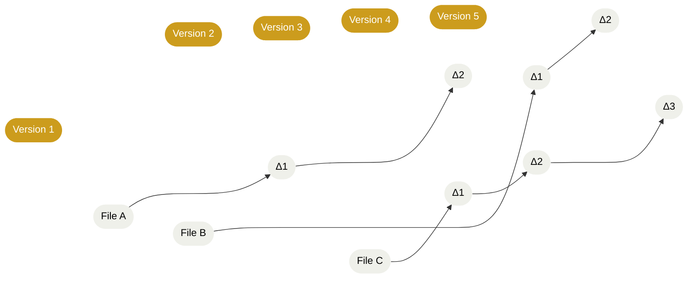
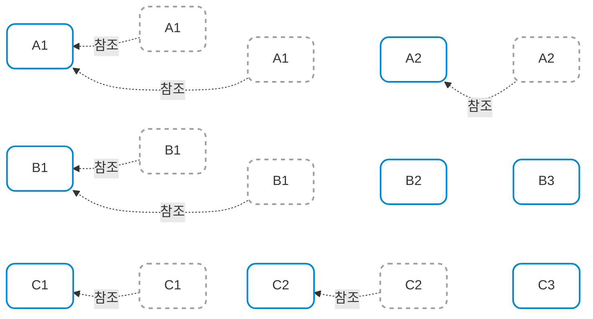

## 형상 관리 (Configuration Management)
소프트웨어를 개발하고 사용하는 과정에서는 코드가 끊임없이 변하게 되는데, CM 은 이렇게 **변화하는 소프트웨어 시스템을 안전하게 관리하기 위한 정책, 프로세스, 그리고 도구들**을 통틀어 일컫는 개념

4가지 대표적인 CM 은 다음과 같다.

### 버전 관리 (Version Control)
시스템을 구성하는 파일들의 변경 이력을 기록하고, 필요할 때 언제든지 이전 버전으로 되돌릴 수 있도록 해주는 기능, 개발자들이 각자 수정한 코드가 서로 충돌(Interfere) 하지 않도록 막아준다, Git 이 대표적인 시스템

### 시스템 빌드 (System Build)
흩어져 있는 코드, 데이터, 라이브러리들을 모아 하나의 실행 가능한 프로그램으로 컴파일 및 링크 하여 빌드하는 과정

### 변경 관리 (Change Management)
고객이나 개발자가 "이 부분 수정해 주세요!"라고 요청한 내역들을 기록, 해당 수정을 위해 비용이나 시간이 얼마나 들지 파악하고, 실제로 적용할지 말지를 결정한다.

### 릴리스 관리 (Release Management)
완성된 소프트웨어를 고객이 사용할 수 있도록 배포(Release) 하는 과정, 배포된 시스템들이 각각 어떤 버전인지 기록하고 추적한다.

> CM은 IT뿐만 아니라 도로, 운하 같은 여러 공학 분야에 두루 적용되는 폭넓은 개념이다.

> 익숙한 IT 서비스로 예시를 들자면
> 1. 버전 관리: Git
> 2. 변경 관리: GitHub(Issues, PR)
> 3. 시스템 빌드: Jenkins, Travis CI, GitHub Actions
> 4. 릴리스 관리: GitHub Releases, Docker Hub, AWS S3

## VCS (Version Control System)
프로젝트의 파일에 대한 변경 사항을 시간에 따라 기록하는 시스템으로, 특정 버전으로 되돌리거나, 시간 경과에 따른 변경 사항을 비교하고, 누가 언제 코드를 수정했는지 식별하는 데 매우 유용하다. (어떤놈이 이따위로 작성했어!)

대규모 소프트웨어 개발 시 팀원 간의 변경 사항이 충돌하지 않도록 제어하고, 협업을 원할하게 하기 위해 필수적 도구로 자리잡았다.

이러한 VCS 는 크게 3가지 유형으로 나눌 수 있다.
### Local VCS
파일의 버전을 **개발자 개인 시스템에 저장**하는 가장 단순한 형태, 복사본을 직접 관리하는것보다야 오류가 적지만, **다른사람과의 협업을 지원하지 않는다**는 한계가 존재함

> 1982년에 개발된 RCS 가 대표적

### Centralized VCS
단일 중앙 서버에 모든 버전의 파일을 저장하고, 클라이언트(개발자) 가 서버로부터 파일을 체크아웃하여 작업한 뒤 서버로 직접 커밋하는 방식

* 장점: 협업이 쉽고 다른 팀원이 어떤 작업을 하고 있는지 파악하기 쉬움
* 단점: 서버에 장애가 발생하면 오프라인 상태에서는 아무 작업도 할 수 없음, 또 확장성, Branch 관리, Merge 가 상대적으로 무겁고 유연하지 않다고 알려져 있다.

> CVS 와 SVN(Subversion) 이 대표적, 특히 SVN 은 Git 이 등장하기 전까지 가장 널리 사용된 VCS 였다.

> Google은 'piper'라는 이름의 고도화된 Centralized VCS를 사용하며 트렁크 기반 개발(Trunk-based development)을 수행하기도 함

### Distributed VCS
클라이언트가 중앙 저장소에서 전체 기록을 로컬 시스템에 복제하여 작업하는 방식, 서버에 장애가 발생해도 기존에 복사했던 기록이 로컬에 남아있기 때문에 작업을 계속할 수 있다.

Centralized VCS 와 달리, Branch 관리와 Merge 가 훨씬 가볍고 유연하며 매우 큰 규모의 팀에서도 쉽게 확장할 수 있다.

> Git 과 Mercurial 이 대표적

> 오픈소스이며 제대로 작동하는 DVCS 가 없어 개빡친 리누스 토르발스가 2주동안 개발한 Git 이 가장 널리 사용되는 VCS 가 되었다.

## 버전 데이터 저장 방식 (패러다임)
파일이 변경되었을때, 변경된 부분만 저장하는 방식과, 변경된 파일 전체의 스냅샷을 저장하는 방식이 있다. 스냅샷이란건 변경된 파일 전체의 복사본을 저장하는 것을 말한다.

### Delta based VCS
파일과 그 파일에 가해진 변경 사항(Delta) 의 집합을 저장하는 방식, CVS 와 SVN 이 대표적

### Snapshot based VCS
커밋할 때마다 변경된 파일을 복사하여 저장하는 방식, 변경되지 않은 파일은 이전 커밋에서 참조하는 방식으로 저장 공간을 절약, Git, Mercurial 이 대표적

> 💡 Delta based VCS 는 **변경된 부분만 저장**하기 때문에 **저장 공간을 절약**할 수 있지만, 특정 버전으로 되돌리거나 변경 사항을 비교할 때 원본 파일에 변경 기록들을 처음부터 끝까지 쭉 연산해야 하기에 **성능 이슈가 발생**할 수 있다.

> 💡 Snapshot based VCS 는 각 버전의 **전체 스냅샷을 저장**하기 때문에 **특정 버전으로 되돌리거나 변경 사항을 비교할 때 빠르게 처리할 수 있**지만, **저장 공간을 더 많이** 사용할 수 있다. 또 이러한 구조는 `.png` 같은 바이너리 파일, 한 파일이 수 GB 되는 AI 가중치 데이터, `.csv` 같은 시계열 데이터 같은 경우에 적합한 방식이 아니다. 소스코드 같은 가벼운 파일을 다루기에 적합한 방식