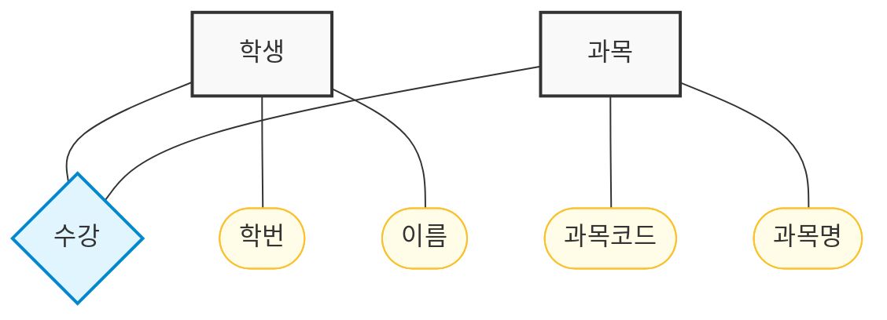

## Schema
1. 외부 스키마 (External Schema) : 사용자 관점에서 데이터베이스의 구조를 정의 (User, View)
2. 개념 스키마 (Conceptual Schema) : 전체 데이터베이스의 논리적 구조를 정의 (Server, SQL)
3. 내부 스키마 (Internal Schema) : 데이터베이스의 물리적 저장 구조를 정의 (Database, Table)

### 외부 스키마 (External Schema)
* 데이터 모델의 외부 단계
* 사용자나 응용 프로그램이 보는 데이터의 형태를 정의
* 각 사용자는 자신이 필요로 하는 맞춤형 데이터를 볼 수 있다.

### 개념 스키마 (Conceptual Schema)
* 데이터 모델의 개념 단계에 해당
* 데이터베이스의 전체 구조를 정의하며, 모든 데이터를 통합하여 표현
* 데이터베이스 관리자가 관리하며, 데이터의 논리적인 구조와 제약 조건을 포함

### 내부 스키마 (Internal Schema)
* 데이터 모델으 내부 단계
* 데이터베이스의 물리적 저장 방식을 정의
* 실제로 데이터가 저장되는 방법과 구조에 대한 정보로, 데이터의 물리적 접근 경로나 저장 형식을 포함

### Example 1
다음에서 설명하는 스키마(Schema) 는?

> 데이터베이스 전체를 정의한 것으로 데이터개체, 관계, 제약조건, 접근권한, 무결성 규칙 등을 명세화 한 것

1. 개념 스키마
2. 내부 스키마
3. 외부 스키마
4. 내용 스키마

> 1

## 개체-관계 모델 (E-R Diagram)
* 개체 (Entity) : 사각형
* 속성 (Attribute) : 타원형
* 관계 (Relationship) : 마름모
* 관계-속성 연결 : 선

### Example 2
개체-관계 모델의 E-R 다이어그램에서 사용되는 기호와 그 의미의 연결이 틀린 것은?
1. 사각형 - 개체 타입
2. 삼각형 - 속성
3. 선 - 개체타입과 속성을 연결
4. 마름모 - 관계 타입

> 2

## RDBMS
* Table = Relation = Entity = 개체
* Attribute = Column = Field = 열 = 속성
  * Domain = Attribute의 값이 가질 수 있는 범위
* Tuple = Row = Record = 행

**EMPLOYEE**
| 사원번호 | 이름 | 직급 | 급여 | 지역번호 |
| --- | --- | --- | --- | --- |
| 1001 | 홍길동 | 대리 | 5000 | 1 |
| 1002 | 김철수 | 과장 | 7000 | 2 |
| 1003 | 이영희 | 사원 | 3000 | 1 |

* Degree = 속성의 개수 : `5`
* Cardinality = 튜플의 개수 : `3`
* 직급의 Domain = `{사원, 대리, 과장, 부장}`

> Tuple 과 Attribute 에는 순서의 의미가 없다.

### Key
* 기본키 (Primary Key) : 튜플을 고유하게 식별하는 키, `NULL` 값을 가질수 없고 `UNIQUE` 해야 한다.
* 후보키 (Candidate Key) : 기본키가 될 수 있는 속성들의 집합, 유일성과 최소성을 만족해야 한다.
* 대체키 (Alternate Key) : 후보키 중에서 기본키로 선택되지 않은 속성
* 슈퍼키 (Super Key) : 유일하게 식별할 수 있는 **속성의 집합**, 후보키를 포함
  * 예시) {사원번호}, {사원번호, 이름}, {사원번호, 직급} 등
  * 유일성은 보장하지만 최소성을 보장하지 않음
* 외래키 (Foreign Key) : 다른 테이블의 기본키를 참조하여 테이블 간의 관계를 형성하는 키, 참조 무결성을 유지하는 역할

> 기본키, 후보키, 대체키는 `NOT NULL`, `UNIQUE` 제약조건이 적용되어야 한다.

> 슈퍼키는 이론적으로 식별 가능하다면 `NULL` 을 포함할 수 있으니 권장되는 방식은 아님

### 무결성
DBMS에 저장된 데이터가 정확하고 일관된 상태를 유지하도록 보장하는 제약 조건
* 개체 무결성 (Entity Integrity) : 가장 대표적으로 키본키는 `NULL` 값을 가질 수 없고 `UNIQUE` 해야 한다는 제약조건
* 범위 무결성 (Domain Integrity) : 속성의 값이 정의된 도메인 내에 있어야 한다는 제약조건 (예시: 직급의 Domain = `{사원, 대리, 과장, 부장}` )
* 참조 무결성 (Referential Integrity) : 외래키가 참조하는 기본키가 존재해야 한다는 제약조건 (예시: EMPLOYEE 테이블의 지역번호가 REGION 테이블의 지역번호를 참조할 때, REGION 테이블에 해당 지역번호가 존재해야 한다)

> 테이블을 어떻게 만드느냐에 따라 외례키의 값은 `NULL` 이 될수 있지만, `NULL` 이 아닐 경우 반드시 참조하는 테이블에 기본키가 존재해야 한다.

### Example 3
속성(attribute)에 대한 설명으로 틀린 것은?

1. 속성은 개체의 특성을 기술한다.
2. 속성은 데이터베이스를 구성하는 가장 작은 논리적 단위이다.
3. 속성은 파일 구조상 데이터 항목 또는 데이터 필드에 해당한다.
4. 속성의 수를 Cardinality 라고 한다.

> 4

### Example 4
관계형 데이터베이스에서 다음 설명에 해당하는 키(Key) 는?

> 한 릴레이션 내의 속성들의 집합으로 구성된 키로서, 릴레이션을 구성하는 모든 튜플에 대한 유일성은 만족시키지만 최소성은 만족시키지 못한다.

1. 후보키
2. 대체키
3. 슈퍼키
4. 외래키

> 3

### Example 5
릴레이션에서 기본 키를 구성하는 속성은 NULL 값이나 중복 값을 가질 수 없다는 것을 의미하는 제약 조건은?

1. 참조 무결성 
2. 보안 무결성
3. 개체 무결성
4. 정보 무결성

> 3

## View
여러 Table 에서 필요한 데이터만을 추출하여 보여주는 가상의 Table

`CREATE` 로 생성, `DROP` 으로 삭제, `ALTER` 로 변경 불가

* 논리적 데이터 독립성 (물리적 저장 구조가 아님)
* 관리가 용이 (보안, 접근 제어, 복잡한 쿼리 단순화)
* 인덱스를 사용할수 없음

View 는 대부분 Read Only 로 사용됨 (`JOIN`, `GROUP BY` 등 이 포함되면 DML 작업 불가)

> 1:1 로 View 가 매핑되는 경우 DML 작업이 가능하지만 일반적인 경우는 아님

> 참조하고 있던 Table 이나 View 가 삭제되면 View 는 Invalid 상태가 됨, `CASCADE` 옵션을 사용하여 참조하는 Table 이나 View 가 삭제될 때 함께 삭제되도록 설정할 수 있음

### Example 6
뷰(VIEW) 에 대한 설명으로 틀린 것은?
1. 뷰 위에 또 다른 뷰를 정의할 수 있다.
2. 뷰에 대한 조작에서 삽입, 갱신, 삭제 연산은 제약이 따른다.
3. 뷰의 정의는 기본 테이블과 같으 ALTER문을 이용하여 변경한다.
4. 뷰가 정의된 기본 테이블이 제거되면 뷰도 자동적으로 제거된다.

> 3, ALTER 가 아닌 DROP 후 CREATE 해야 함

## 데이터 사전 (System Catalog)
DBMS 가 자동으로 DDL 실행으로 생성되는 Table, View, Index, Package, 접근 권한 등의 데이터베이스구조 및 통계 정보와 같은 메타데이터를 저장하는 곳

* 일반 User 도 System Catalog 에 검색 가능
* 일반 User 는 System Catalog 를 갱신 불가
* **DBMS 가 스스로 생성하고 유지**

### Example 7
시스템 카탈로그에 대한 설명으로 옳지 않은 것은?

1. 사용자가 직접 시스템 카탈로그의 내용을 갱신하여 데이터베이스 무결성을 유지한다.
2. 시스템 자신이 필요로 하는 스키마 및 여러 가지 객체에 관한 정보를 포함하고 있는 시스템 데이터베이스 이다.
3. 시스템 카탈로그에 저장되는 내용을 메타데이터라고도 한다.
4. 시스템 카탈로그는 DBMS 가 스스로 생성하고 유지한다.

> 1

## SQL
### DDL (Data Definition Language)
* CREATE : Table 생성
* ALTER : Table 구조 변경 (예시: 컬럼 추가, 삭제, 데이터 타입 변경)
* DROP : Table 삭제
* TRUNCATE : Table 의 모든 데이터 삭제 (구조는 유지)

### DML (Data Manipulation Language)
* SELECT
* INSERT
* UPDATE
* DELETE

### DCL (Data Control Language)
* GRANT : 권한 부여
* REVOKE : 권한 회수

### TCL (Transaction Control Language)
* COMMIT : 트랜잭션 확정
* ROLLBACK : 트랜잭션 취소

### Example 8
다음 SQL에서의 DDL 문이 아닌 것은?
1. CREATE
2. DELETE
3. ALTER
4. DROP

> 2

## Transaction
ACID

* Atomicity (원자성) : All or Nothing
* Consistency (일관성) : 트랜잭션이 실행되기 전과 후에 데이터베이스가 일관된 상태를 유지 (예시: 제약조건, 트리거, 뷰 등)
* Isolation (격리성) : 동시에 실행되는 트랜잭션이 서로 간섭하지 않도록 보장
* Durability (지속성) : 트랜잭션이 성공적으로 완료되면 그 결과가 영구적으로 저장되어야 한다는 원칙

### Example 9
데이터베이스의 트랜잭션 성질 중에서 다음 설명에 해당하는 것은?

> 트랜잭션의 모든 연산들이 정상적으로 수행 완료되거나 아니면 전혀 어떠한 연산도 수행되지 않은 원래 상태가 되도록 해야 한다.

1. Atomicity
2. Consistency
3. Isolation
4. Durability

> 1

## Locking
여러 사람이 같인 테이블에 동시에 접근할 때 데이터의 일관성을 유지하기 위해 LOCK 을 사용

Locking 단위가 작으면 병행성 증가하나 제어가 어려워짐, 방마다 키를 걸어놓냐 아니면 현관문에 키를 걸어놓냐의 차이

### Example 10
병행제어의 로킹(Locking) 단윙 대한 설명으로 옳지 않은 것은?

1. 데이터베이스, 파일, 레코드 등은 로킹 단위가 될 수 있다.
2. 로킹 단위가 작아지면 로킹 오버헤드가 증가한다.
3. 한꺼번에 로킹할수 있는 단위를 로킹 단위라고 한다.
4. 로킹 단위가 작아지면 병행성 수준이 낮아진다.

> 4