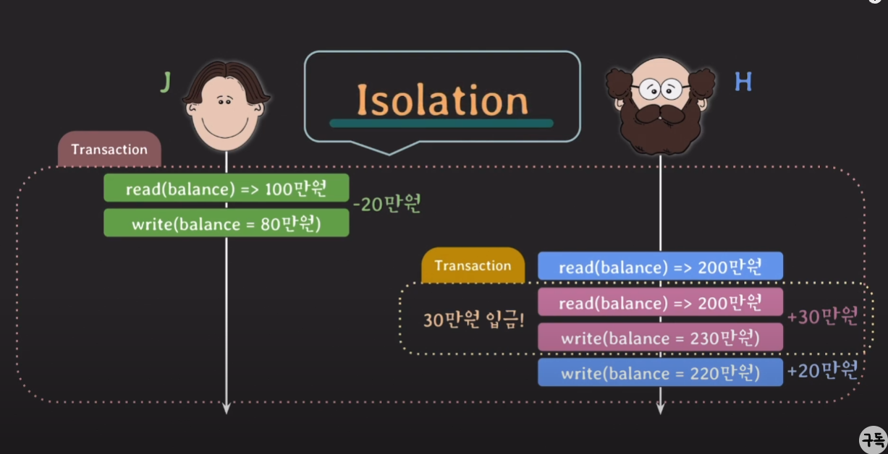

# Transaction이 필요한 이유
은행에서 돈을 이체하는 간단한 예제부터 생각해 보겠습니다. 예시로 사용할 테이블은 다음과 같습니다.
| account_id | balance |
|------------|---------|
| A          | 100000  |
| B          | 200000  |

**문제:** A가 B에게 10만원을 이체할떄 각자의 계좌는 어떻게 변경돼야 할까요? A의 계좌에는 100만원이, B의 계좌에는 200만원이 있다 가정해 보겠습니다.
1. 먼저 A의 계좌에서 10만원을 빼야 합니다. 이때 A의 계좌에는 90만원이 남게 됩니다.
2. B의 계좌에 10만원을 더해야 합니다. 이때 B의 계좌에는 210만원이 됩니다.

이를 SQL로 표현하면 다음과 같습니다.
```sql
UPDATE account SET balance = balance - 100000 WHERE account_id = 'A';
UPDATE account SET balance = balance + 100000 WHERE account_id = 'B';
```

이때 문제가 발생할 수 있습니다. 만약 A의 계좌에서 10만원을 빼는 쿼리는 성공했지만, B의 계좌에 10만원을 더하는 쿼리에서 오류가 발생한다면 어떻게 될까요? A의 계좌에서는 10만원이 빠져나갔지만, B의 계좌에는 돈이 들어오지 않아서 돈이 사라지게 됩니다. 그 반대의 상황에도 심각한 문제가 발생합니다. 이렇듯 이체라는 작업은 <R>두개의 쿼리가 동시에 성공해야만 성공하는 단일작업</R>입니다.

이렇게 두개 이상의 쿼리가 동시에 성공해야만 성공하는 작업을 **트랜젝션(Transaction)**이라고 합니다. 트랜젝션의 특징은 다음과 같습니다.
1. 논리적인 이유로 여러 SQL문들을 단일 작업으로 묶어 나눠질수 없는 하나의 단위로 처리합니다.
2. Transaction의 SQL문들 중에 일부만 성공해서 DB에 반영되는 일은 일어나지 않습니다.

이제 코드로 트랜젝션을 구현해 보겠습니다. 다음과 같이 두개의 쿼리를 하나의 트랜젝션으로 묶어서 실행할 수 있습니다.
```sql
START TRANSACTION;
UPDATE account SET balance = balance - 100000 WHERE account_id = 'A';
UPDATE account SET balance = balance + 100000 WHERE account_id = 'B';
COMMIT;
```

이전에 보지 않았던 `START TRANSACTION`과 `COMMIT`이라는 새로운 명령어가 등장했습니다. 각 명령어를 살펴보겠습니다.
1. `START TRANSACTION`: 트랜젝션을 시작하는 명령어 입니다.
2. `COMMIT`: 지금까지 작업한 내용을 DB에 <R>영구적으로(permanently) 저장하는 명령어</R> 이자 Transaction을 종료하는 명령어 입니다.
    * 영구적으로 저장한다가 어떠한 의미를 가진지는 뒤에 좀더 자세히 다루겠습니다.

실행 결과는 다음과 같습니다.
| account_id | balance |
|------------|---------|
| A          | 90000   |
| B          | 210000  |

## ROLLBACK
이제 트랜젝션의 또다른 중요한 명령어인 `ROLLBACK`에 대해 알아보겠습니다. `ROLLBACK`은 트랜젝션을 취소하는 명령어 입니다. 즉, 트랜젝션을 시작한 이후에 문제가 발생했을때, 트랜젝션을 취소하고 이전 상태로 되돌리는 명령어 입니다. 위 예제에서 A가 B에게 20만원을 이체하는 작업을 수행한다 가정해 보겠습니다. A의 계좌에는 10만원만 있기 때문에 이 작업은 실패해야 합니다.
```sql
START TRANSACTION;
SET @current_balance = (SELECT balance FROM account WHERE account_id = 'A');
UPDATE account SET balance = balance - 200000 WHERE account_id = 'A';
IF @current_balance - 200000 < 0 THEN
    ROLLBACK;
    SELECT 'Transaction cancelled: Insufficient funds' AS message;
ELSE
    UPDATE account SET balance = balance + 200000 WHERE account_id = 'B';
    COMMIT;
    SELECT 'Transaction completed successfully' AS message;
END IF;
```

위 예제의 동작 순서를 살펴보겠습니다.
1. A의 계좌 정보를 조회해 `current_balance` 변수에 저장합니다.
2. A의 계좌에서 10만원을 빼는 작업을 수행합니다.
3. A의 계좌가 음수면 `ROLLBACK`을 수행하고 **Transaction cancelled: Insufficient funds**를 출력합니다.
4. A의 계좌가 음수가 아니면 B의 계좌에 20만원을 더하는 작업을 수행합니다.
5. 모든 작업이 성공하면 `COMMIT`을 수행하고 **Transaction completed successfully**를 출력합니다.

실행 결과는 다음과 같습니다.

[실행 결과 필요]


## AUTOCOMMIT
트랜젝션을 사용해봤으니 새로운 개념인 `AUTOCOMMIT`에 대해 알아보겠습니다. `AUTOCOMMIT`은 <R>각각의 SQL문을 자동으로 Transaction처리 해주는 개념</R> 입니다. 즉, `AUTOCOMMIT`이 활성화 돼어 있다면 INSERT건 SELECT건 DELETE건 각각의 SQL문이 성공적으로 실행됐다면 자동으로 `COMMIT`이 수행되고, 실패했다면 자동으로 `ROLLBACK`이 수행됩니다. **MySQL**을 비롯한 대부분의 DBMS에서는 이러한 `AUTOCOMMIT`이 기본적으로 활성화 되어 있습니다. `AUTOCOMMIT`을 활성화 여부를 확인하려면 다음 쿼리를 실행하면 됩니다.
```sql
SELECT @@AUTOCOMMIT;
```

**OUTPUT**
| @@AUTOCOMMIT |
|--------------|
| 1            |


`@@AUTOCOMMIT`이 1이라면 `AUTOCOMMIT`이 활성화 되어 있는 상태입니다. 이러한 상태에서 INSERT문을 사용한다면 내부적으론 이렇게 처리됩니다.
1. INSERT문을 성공적으로 실행했다면 자동으로 `COMMIT`이 수행됩니다.
2. 테이블에 데이터가 영구적으로 저장됩니다.

이제 `AUTOCOMMIT`을 비활성화 해보겠습니다.
```sql
SET AUTOCOMMIT = 0;
```

이제 더이상 `AUTOCOMMIT`이 활성화 되어 있지 않습니다. 이제부터는 `COMMIT`이나 `ROLLBACK`을 명시적으로 수행해야 합니다. 이제 다음 쿼리를 실행해보겠습니다.
```sql
INSERT INTO account VALUES ('C', 300000);
INSERT INTO account VALUES ('D', 400000);
```
**OUTPUT**
`Query OK, 2 row affected`, 성공적으로 2개의 행이 추가됐다는 메시지가 출력됩니다. 이제 한번 **account** 테이블을 조회해보겠습니다.

**INPUT**
```sql
SELECT * FROM account;
```
**OUTPUT**
| account_id | balance |
|------------|---------|
| A          | 90000   |
| B          | 210000  |
| C          | 300000  |
| D          | 400000  |

이러한 결과가 나오게 됄것입니다. 이떄 한번 `ROLLBACK`을 수행해보겠습니다.
**INPUT**
```sql
ROLLBACK;
```

**OUTPUT**
`Query OK, 0 row affected`, 성공적으로 트랜젝션이 취소됐다는 메시지가 출력됩니다. 이제 다시 **account** 테이블을 조회해보겠습니다.

**INPUT**
```sql
SELECT * FROM account;
```
**OUTPUT**
| account_id | balance |
|------------|---------|
| A          | 90000   |
| B          | 210000  |

이러한 결과가 나오게 됄것입니다. `C`와 `D`라는 계좌가 추가됐지만 `ROLLBACK`을 수행했기 때문에 사라졌습니다. 이렇듯 `AUTOCOMMIT`을 비활성화 하면 `COMMIT`이나 `ROLLBACK`을 명시적으로 수행해야 합니다.

하지만 이런 의문이 생깁니다. 이전 예제에서 `START TRANSACTION`을 수행했을때 `AUTOCOMMIT`이 활성화 돼어 있었는데 이러한 상황에서 `UPDATE`문은 자동으로 `COMMIT`이 수행됄까? 이에 대한 답은 **NO**입니다. `START TRANSACTION`과 `COMMIT`은 내부적으로 `AUTOCOMMIT` 을 활성화, 비활성화 하는 기능을 수행합니다.

1. `START TRANSACTION`: `AUTOCOMMIT`을 비활성화 하고 트랜젝션을 시작합니다.
2. `COMMIT`: 트랜젝션을 종료하고 `AUTOCOMMIT`을 활성화 합니다.
3. `ROLLBACK`: 트랜젝션을 취소하고 `AUTOCOMMIT`을 활성화 합니다.

만약 `AUTOCOMMIT`이 비활성화 돼어 있다면 `COMMIT`이나 `ROLLBACK`이 돼어도 `AUTOCOMMIT`은 활성화 되지 않습니다.

***
# ACID
트랜젝션은 ACID라는 핵심적인 4가지 특성을 가지고 있습니다. 이러한 특성들은 트랜젝션이 반드시 지녀야 하는 특성들입니다. ACID는 다음과 같습니다.

1. **원자성(Atomicity):** 트랜젝션은 하나의 단위로 간주되어야 합니다. 즉, 트랜젝션은 모두 성공하거나 모두 실패해야 합니다.
2. **일관성(Consistency):** 트랜젝션이 실행된 이후에도 데이터베이스는 일관된 상태를 유지해야 합니다.
3. **격리성(Isolation):** 트랜젝션은 다른 트랜젝션에 영향을 받지 않아야 합니다.
4. **지속성(Durability):** 트랜젝션이 성공적으로 완료됐다면 그 결과는 영구적으로 저장되어야 합니다.

## 원자성(Atomicity)
Atomicity는 All or Nothing이라고도 불립니다. 즉, <R>트랜젝션은 모두 성공하거나 모두 실패해야 합니다.</R> 이러한 특성은 `COMMIT`이나 `ROLLBACK`을 통해 구현됩니다. 만약 트랜젝션 중간에 문제가 발생한다면 `ROLLBACK`을 수행해 아무일도 없었던 것처럼 되돌립니다. 결과적으로 Database가 계속 일관된 상태를 유지할 수 있게 됩니다.

DBA는 Transaction의 단위를 언제 어떻게 정의하고 언제 `COMMIT`과 `ROLLBACK`을 수행할지 결정해야 합니다. 이러한 작업을 **Transaction Management**라고 합니다.

## 일관성(Consistency)
이전 account 예제에선 따로 조건문을 사용해 A의 계좌가 음수가 되는지 확인했습니다. 하지만 보통 이러한 작업은 DBMS에서 제공하는 **Constraint**를 사용해 구현합니다. 때문에 account의 테이블은 이러한 제약조건을 가지고 있습니다.

```sql
CREATE TABLE account (
    account_id CHAR(1) PRIMARY KEY,
    balance INT CHECK (balance >= 0)
);
INSERT INTO account VALUES ('A', 100000);
INSERT INTO account VALUES ('B', 200000);
```

이때 A가 B에게 20만원을 이체하는 작업을 수행한다 가정해 보겠습니다. 만약 이러한 요청이 들어왔다면 A의 계좌에서 20만원을 빼는 `UPDATE`문은 실패하게 됩니다. 즉, 해당 `UPDATE`문은 일관성을 유지하기 위해 `ROLLBACK`이 수행됩니다.
```sql
START TRANSACTION;
UPDATE account SET balance = balance - 200000 WHERE account_id = 'A';
UPDATE account SET balance = balance + 200000 WHERE account_id = 'B';
COMMIT;
```

일관성을 요약하면 다음과 같습니다.
* **Transaction**은 DB 상태를 일관된 상태(consistent)에서 또 다른 일관된 상태(consistent)로 변경해야 합니다.
* **constraints**, **trigger** 등을 통해 DB에 정의된 rules을 Transaction이 위반했다면 `ROLLBACK` 해야 합니다.
* **Transaction**은 DB에 정의된 rules을 위반했는지는 DBMS가 `COMMIT`전에 확인하고 알려줍니다.


## 격리성(Isolation)
A가 B에게 10만원을 이체하는 동시에 B가 자신의 계좌로 30만원을 입금한다 가정해 보겠습니다.



1. A에서 B로 20만원을 송금하는 Transaction-A을 시작합니다.
2. 먼저 A의 계좌에 대해 read를 수행해 100만원이 있다는것을 확인합니다.
3. A의 계좌에서 20만원을 빼 80만원을 write합니다.
4. 이제 B의 계좌에 20만원을 넣어주어야 하기 때문에 B의 계좌를 read해 200만원이 있다는것을 확인합니다.
    1. 이 타이밍에 B가 자신의 계좌로 30만원을 입금한다 해보겠습니다. 그러므로 B의 계좌로 30만원을 입금하는 Transaction-B가 발생합니다.
    2. Transaction-A는 아직 `COMMIT`돼지 않았기 때문에 B의 현재 계좌 잔액인 200만원을 read합니다.
    3. 이후 B의 계좌에 30만원을 더한 230만원을 write합니다.
    4. Transaction-B는 `COMMIT`됩니다.
5. Transaction-A는 Transaction-B가 `COMMIT`돼기 이전에 B의 계좌를 read했기 때문에 B의 현재 계좌 잔액이 230만원인것을 모릅니다.
6. Transaction-A는 200만원에 20만원을 더한 220만원을 write합니다.
7. Transaction-A는 `COMMIT`됩니다.

결과적으로 30만원이 사라지는 이상한 동작이 발생합니다. 이러한 문제를 **Dirty Read**라고 합니다. 이러한 문제를 해결하기 위해 **Isolation**이라는 Transaction의 중요한 특성이 존재합니다. **Isolation**의 개념은 <R>여러 Transaction이 동시에 실행될때 각 Transaction이 서로 영향을 미치지 않도록 마치 혼자 실행되는 것처럼 동작하게 만드는것</R> 입니다. 하지만 이러한 **Isolation**을 엄격하게 적용하면 성능이 저하될 수 있습니다. 때문에 DBMS는 여러 종류의 **Isolation Level**을 제공합니다. **Isolation Level**이 높으면 높을수록 **Isolation**이 엄격해지면서 다른 Transaction에 의해 발생하는 문제를 줄일 수 있습니다. 대신 동시성이 떨어지게 됩니다. DBA는 **Isolation Level**을 선택해야 하며, 이는 **Transaction Management**의 중요한 부분입니다.

## 지속성(Durability)
또는 용존성 이라고도 말하는 **Durability**는 <R>`COMMIT`된 Transaction은 DB에 영구적으로 저장된다.</R> 라는 개념입니다. 여기서 영구적이라는것은 **DB system에 문제(power fail or DB crash)가 생겨도 `COMMIT`된 Transaction은 DB에 남아 있어야 한다**는 의미입니다. 간단히 말해 비휘발성 메모리(HDD, SSD...)에 저장함을 의미하기도 합니다. 기본적으로 DBMS가 보장합니다.


