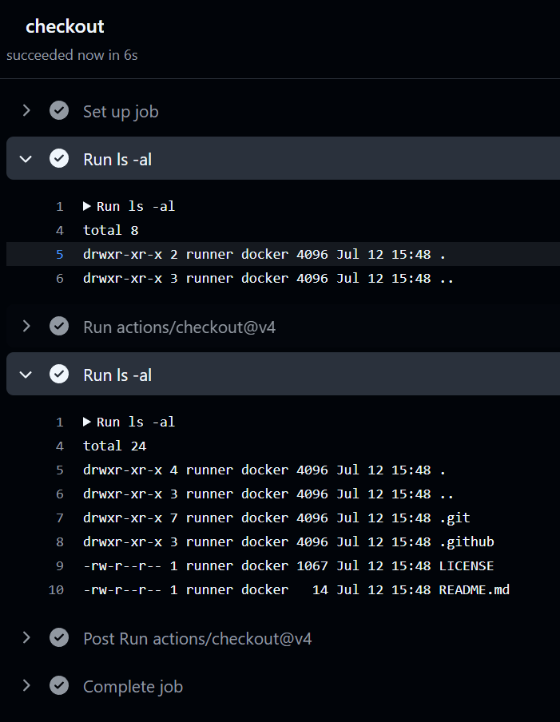
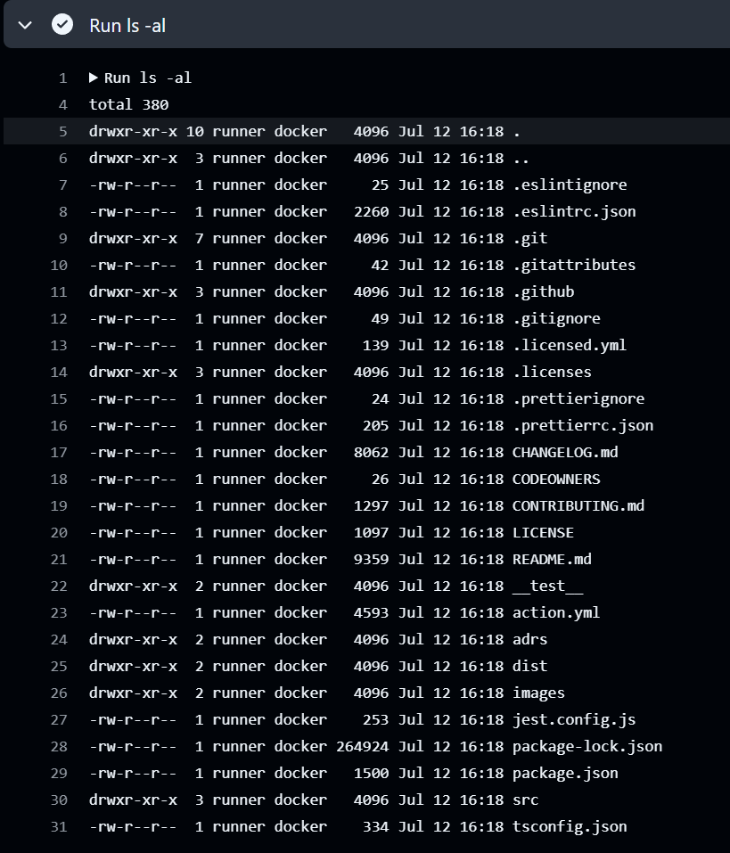

# Checkout

`ls -al` 명령어를 실행해 봤지만 아무 파일도 보이지 않습니다. 왜 그럴까요?

사실 이전에 작성한 코드는 CI 서버만 지정한거지, 현재 Repository 의 코드를 가져오려면 추가 코드가 필요합니다.

먼저 Git 시스템에서 Checkout 이란, Branch 를 변경하는 작업을 의미합니다.

Github-Action 에선 현재 Repository 에서 CI 서버로 코드를 가져오기 위한 작업을 Checkout 이라고 부릅니다.

하지만 이러한 Checkout 작업은 반복적이고 매번 수동으로 작성하기 번거롭습니다. 개발을 진행할때 모든 코드를 직접 작성하는것보단 Open Source 로 제공되는 코드를 활용하는 것처럼 GitHub Actions 에서도 Open Source 로 제공되는 Action 을 활용할 수 있습니다.

Github Action 에서 다른사람이 작성한 Action 을 활용하는 방법은 `uses` 키워드를 사용하는 것입니다.

> `uses: <owner>/<repo>@<ref>`

`<owner>` 는 GitHub 사용자명 또는 조직명, `<repo>` 는 저장소 이름, `<ref>` 는 브랜치, 태그, 커밋 해시 등을 지정합니다.

```yaml
name: Checkout
on:
  push:
    branches:
      - main

jobs:
  checkout:
    runs-on: ubuntu-latest
    steps:
      - run: ls -al
      - uses: actions/checkout@v4
      - run: ls -al
```

이전 코드와 달라진 부분

1. `main` 브랜치에 푸시 이벤트가 발생했을 때만 워크플로우가 실행되도록 `on` 항목을 수정했습니다.
2. `actions/checkout@v4` 사용

> 우측의 Market place 탭에서 `actions/checkout` 을 검색해 보세요. 해당 저장소와 사용 설명서를 확인할 수 있습니다.

현재 기준 최신버전은 `actions/checkout@v4.2.2` 입니다. 하지만 모든 버전을 명시할 필요 없이 `actions/checkout@v4` 로 작성해도 최신 버전이 사용됩니다.

이후 커밋하면, checkout 이전엔 아무 파일도 보이지 않다가 checkout 이후엔 Repository 의 파일들이 보이는 것을 확인할 수 있습니다.



한번 `checkout` Action 의 실행 로그를 살펴보시면 꽤 많은 일들을 하고 있는걸 볼 수 있습니다. 만약 이러한 작업을 직접 작성했다면 꽤 많은 코드가 필요했을 것입니다.

## optional parameters

이렇듯 다른사람이 만들어둔 Action 을 활용하는 일이 상당히 많습니다.

하지만 Action 을 그대로 사용하기엔 현재 프로젝트의 요구상황과 맞지 않는 경우가 대부분일 겁니다.

함수도 매개변수를 통해 다양한 상황에 맞게 활용하는 것처럼, Action 도 매개변수를 통해 다양한 상황에 맞게 활용할 수 있습니다.

Action 의 매개변수는 `with` 키워드를 사용하여 전달할 수 있습니다.

물론 이렇게 매개변수를 전달하기 위해선, 해당 Action 이 매개변수를 지원해야 합니다.

```yaml
name: Checkout
on:
  push:
    branches:
      - main

jobs:
  checkout:
    runs-on: ubuntu-latest
    steps:
      - uses: actions/checkout@v4
				with:
					path: 'src'
      - run: ls -al
			- run: pwd
			- run: cat src/.github/workflows/first.yml
```

* path : Checkout 한 파일들을 저장할 경로를 지정합니다. 기본값은 현재 작업 디렉토리입니다. 여기선 `src` 디렉토리에 저장하도록 지정했습니다.
* `ls -al` : `src` 디렉토리 내의 파일 목록을 출력합니다.
* `pwd` : 현재 작업 디렉토리의 경로를 출력합니다.
* `cat src/.github/workflows/first.yml` : `src` 디렉토리 내의 `first.yml` 파일 내용을 출력합니다.

## 다른 Repository 코드 가져오기

checkout Action 은 현재 Repository 뿐만 아니라 공개된 다른 Repository 의 코드도 가져올 수 있습니다.

여기선 `checkout@v4` 자체의 소스코드를 한번 그대로 가져와 보겠습니다.

다른사람의 소스코드를 가져오기 위해선 `repository` 매개변수를 사용합니다.

```yaml
name: Checkout
on:
  push:
    branches:
      - main

jobs:
  checkout:
    runs-on: ubuntu-latest
    steps:
      - uses: actions/checkout@v4
				with:
					repository: 'actions/checkout'
					ref: v4
      - run: ls -al
```

* `repository: 'actions/checkout'` : 소유자가 `actions` 이고, 저장소 이름이 `checkout` 인 GitHub 저장소의 코드를 가져옵니다.
* `ref: v4` : `v4` 태그를 가진 커밋을 가져옵니다. 이 태그는 `actions/checkout` 저장소의 최신 버전입니다.

이후 결과를 확인해보면 `actions/checkout` 에서 작성된 파일들이 출력되는것을 확인할 수 있습니다.

보통 Github Actions 를 담고 있는 저장소의 경우 root 에 `action.yml` 파일이 존재합니다.

