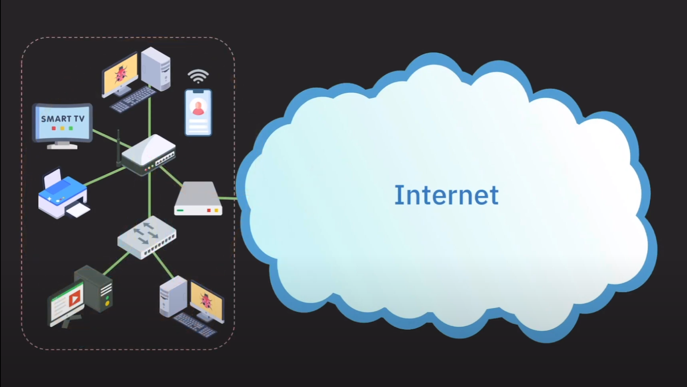

# 소개
이 책은 네트워크를 이해하고 싶은 사람들을 위한 책입니다. 네트워크는 컴퓨터 공학에서 중요한 개념이며, 현대 사회에서는 네트워크가 없으면 살 수 없는 시대가 되었습니다. 이 책은 네트워크의 기본 개념부터 시작하여, 네트워크의 구조, 프로토콜, 보안, 그리고 네트워크의 응용까지 다루고 있습니다.

네트워크 응용 단계에선 자신의 Desktop PC를 웹서버로 만들어서, 다른 사람들이 자신의 컴퓨터에 접속할 수 있도록 하는 방법을 다루고 있습니다. 또한, Oracle cloud 서비스를 이용하여 자신의 웹페이지를 서버에 업로드 하여 전세계 사람들이 접속할 수 있도록 하는 방법도 다루고 있습니다.

이 책을 통해 웹개발, 서버개발에 필요한 네트워크 지식을 습득할 수 있으며, 네트워크 관련 자격증을 취득하기 위한 기초 지식을 습득할 수 있습니다.

***

# 인터넷이란 무엇인가?
컴퓨터 네트워크를 공부한다는것은 곧 인터넷을 공부한다는 것과 같습니다. 인터넷을 사용자 입장에서 정의하자면 다음과 같이 정의할 수 있습니다. **전세계 사람들과 파일을 주고받을수 있는 하드웨어, 소프트웨어 시스템** 입니다.

또는 이런식으로 정의해볼수 있습니다. 인터넷은 사실 줄임말로 원래 의미는 **Inter-connected network of networks** 입니다. 이것을 줄여서 인터넷(Internet) 이라고 부릅니다. 이 말은 네트워크를 상호 연결한 네트워크라는 뜻입니다. 네트워크를 연결하면 인터넷이 되는 것이죠. 사실 네트워크또한 어떠한 네트워크들의 연결로 이루어져 있긴 합니다.

둘중 이해하기 편한것을 선택하면 됩니다. 컴퓨터과학이란 분야가 100년도 안됀 분야이기 때문에 이러한 용어들이 엄밀하게 딱 정의되어 있지 않습니다.

## 인터넷을 사용하려면?
보통 인터넷을 사용하고 싶다면 SKT같은 회사에 전화를 걸어 **인터넷에 가입하고 싶습니다~** 라고 전화를 하면 기사님이 오셔서 알아서 인터넷을 사용할수 있게 해주기에 굳이 이걸 깊게 생각하지 않았습니다. 하지만 Network를 배우는 시간이기 때문에 예제의 그림과 같은 일반적인 가정용 네트워크가 어떻게 만들어지는지 알아보겠습니다.

### IP 주소 할당
인터넷에 연결되기 위해 기본적으로 IP 주소를 할당 받아야 합니다. 보통 통신사에서 알아서 IP주소를 할당해 줍니다. **모든 네트워크 장비들은 IP 주소를 가지고 있습니다.** IP 주소는 마치 현실세계의 주소와 같은 역할을 합니다. 배달음식을 주문해 먹고 싶다면 식당에 자신의 주소를 알려줘야 하듯, Google, Naver같은 회사의 서비스를 이용하고 싶다면 해당 서비스에 자신의 IP 주소를 알려줘야 서비스를 받을 수 있습니다.

### 모뎀 연결
이제 실제 존재하는 물리적인 인터넷과 연결돼기 위한 과정이 필요합니다. 인터넷을 사용하는 이유는 외부 사람들과 데이터를 주고받기 위함이기 때문에 **외부사람이 속해있는 네트워크에 연결**되어야 합니다. 이때 사용하는 장치가 **모뎀** 입니다.

모뎀이란 아날로그/디지털 변환기의 일종으로 컴퓨터의 디지털 신호를 아날로그 신호로 바꾸어 전송하고, 아날로그 신호를 받아 디지털 신호로 읽어내는 장치 입니다. 아날로그/디지털 이란 용어에 무서워하지 않으셔도 됍니다. 이러한 **하드웨어 기기들은 전자공학에서 다루는 내용**이기 때문이죠

### 공유기 연결
이제 이러한 모뎀에 공유기를 연결시켜줘야 합니다. 공유기는 다른말로 **home router**라고도 불리며, **여러 기기들을 인터넷에 연결될 수 있도록 하는 장치** 입니다. 공유기의 추가적인 기능으론 할당받은 **하나의 IP 주소로 여러 기기들이 동시에 인터넷을 사용하는 것이 가능**하도록 해줍니다. 이렇게 공유기에 연결된 기기들은 같은 네트워크(home network)에 소속되어 있습니다.

### 스위치 연결
일반적인 가정용 공유기에 스위치까지 연결할 일은 없지만 한번 알아봅시다. 만약 컴퓨터가 여러대라서 공유기에 유선으로 연결시켜주려 했는데 공유기에 랜선을 연결할 수 있는 포트가 부족한 상황을 가정해 봅시다. 이럴때는 스위치(Switch)을 구매해서 연결하면 됍니다. 스위치는 같은 네트워크 내의 기기들이 서로 통신할 수 있도록 해주는 장치입니다. 보통 공유기의 랜(ethernet) 포트가 부족할때 사용합니다.

### 완성
지금까지 집에서 어떻게 네트워크를 구성하는지 알아보았습니다. 이제 이러한 네트워크를 통해 각각의 기기들은 인터넷을 사용할 수 있습니다. 뿐만 아니라 각각의 기기들또한 같은 네트워크에 속해 있기 때문에 서로 통신할 수 있습니다.
