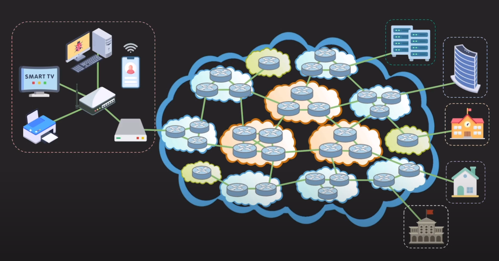
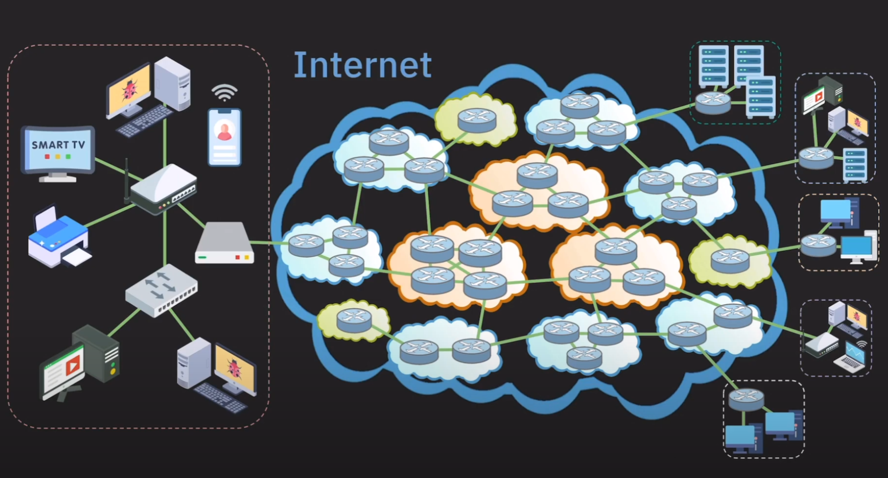

# Basic Networking Terminology
이번 장에선 네트워크를 구성하는 장비들과 네트워크를 구성, 구분하는 용어들에 대해 알아보겠습니다.

***

# 네트워크를 구분하는 방법
네트워크를 구성하는 요소들이 모이고 모여 네트워크를 형성했다고 가정해 보겠습니다. 그렇게 형성된 네트워크의 범위는 어느 정도일까요? 일반 가정이 될 수도 있고, 기업이 될 수도 있으며, 때로는 도시나 국가가 될 수도 있습니다. 이렇듯 네트워크의 구성 범위가 다양한 만큼 네트워크를 범위에 따라 분류하는 기준도 존재합니다. 네트워크는 범위에 따라 크게 LAN(Local Area Network), WAN(Wide area network)로 나눌수 있습니다.

## LAN
LAN은 Local Area Network의 약자로 가정, 기업, 학교처럼 한정된 공간(보통 건물)에서 데이터나 리소스를 공유할 수 있게 하는 네트워크를 의미합니다. 가정에서 공유기를 통해 프린터와 컴퓨터를 연결하는것이 대표적인 LAN입니다. 범위가 좁고 연결하는 거리가 짧은 만큼 신호가 약해지거나 오류가 발생할 확률이 적습니다. 군대와 같이 외부와 차단하고 내부에서만 사용하는 네트워크도 LAN에 속합니다.

LAN을 구성하는 두가지 중요한 기술이 있습니다. Ethernet과 Wi-Fi입니다. Ethernet은 흔히 랜선으로 불리며 유선으로 연결하는 기술입니다, Wi-Fi는 무선으로 연결하는 기술입니다.

## WAN
WAN은 Wide Area Network의 약자로 LAN보다 넓은 범위의 네트워크를 의미합니다. 간단히 **여러 LAN이나 다른 종류의 네트워크들을 하나로 묶어서 멀리 떨어진 기기들도 통신이 가능하도록 만든 네트워크**를 의미합니다. 인터넷 또한 WAN의 한 예입니다. 인터넷은 LAN을 포함한 전세계의 인터넷을 연결한 것이며, **global WAN**이라고도 불립니다.

***

# ISP(Internet Service Provider)
네트워크, 인터넷이란 시스템은 인간이 구축한 가장 거대한 시스템 중 하나입니다. 이러한 시스템은 개인이 운영하는것은 불가능 하기에 이러한 시스템을 **유지, 관리, 서비스 제공을 하는 회사들**이 존재합니다. 이러한 회사들을 **ISP(Internet Service Provider)**라 부릅니다. 우리나라로 치면 KT, SKT, LG U+ 등이 이에 해당합니다.

그렇다면 이러한 궁금증이 생길수 있습니다. 지금 현재 사용하는 컴퓨터는 SKT에 가입하여 인터넷을 사용하고 있는데, 지금 사용하고 있는 서비스는 어떤 ISP에 가입돼어 있길레 사용 가능한거지? 이러한 의문을 해결하기 위해선 지금까지 구름으로 가려졌던 ISP들에 의해 연결돼어 있는 인터넷의 코어를 알아보아야 합니다.

## Core Network
구름의 뚜껑을 열어보면 이렇게 생겼습니다. 다양한 ISP들이 자신들의 네트워크를 가지고 있고 이러한 ISP들도 서로 연결이 돼어 있어 서로 다른 ISP들 끼리도 통신이 가능하게 되어 있습니다. 이러한 네트워크를 **Core Network**라 부릅니다. 결과적으로 지금 사용하고 있는 서비스의 서버는 다른 ISP에 가입이 돼어 있어도 서로 통신이 가능합니다.

## Tier 1 ISP
대기업, 중견기업, 중소기업이 나누어져 있듯이 ISP들도 역할과 규모에 따라 Tier가 나누어 집니다. 먼저 Tire 1부터 살펴보겠습니다.

Tier 1은 국제 범위의 네트워크를 보유하고 있습니다. 국제범위란 국가간의 네트워크를 의미합니다. Tier 1 회사가 보유한 네트워크를 통하면 인터넷의 모든 네트워크에 접근 가능합니다. 단순히 그림을 보며 생각하면 됍니다. Tire 1으로부터 접근이 불가능한 Tier1, Tier 2, Tier 3 네트워크는 존재하지 않습니다.

그렇기에 인터넷의 중추 역할을 한다 해서 **Backbone Network**라고도 불립니다. 이렇기에 보통 일반 사용자, 기업들은 Tier 1 ISP에 직접 가입하는 경우는 드뭅니다. 이들은 인터넷이 전세계를 커버할수 있도록 관리하는 역할을 합니다. Tier 1 ISP의 특징점중 하나는 트래픽 전송 비용이 없습니다. 트래픽이란 용어는 나중에 살펴보고 지금은 편하게 데이터라고 생각하면 됍니다.

비용이 왜 들지 않냐면 네트워크를 이용한다는건 결국 Tier 1 ISP의 네트워크를 이용하겠다 라는 것이디 때문에 Tier 1 ISP 끼리는 서로 돈을 내지 말자는 협약을 했습니다. 또 이러한 상황도 있습니다. Tier 2가 멀리 떨어진 Tier 2에게 데이터를 보내려고 하려면 `Tier 2 -> Tier 1 -> Tier 2` 이런식으로 보내야 합니다. 이때 보내는쪽인 Tier 2는 Tier 1에게 비용을 내지만 Tier 2에게 데이터를 보내는 Tier 1은 비용을 내지 않습니다. 어떻게 보면 최상위 포식자라고 볼수도 있겠습니다.

## Tier 2 ISP
Tier 2 ISP는 국가나 지방 범위의 네트워크를 보유하고 있습니다. 우리나라의 통신사들이 Tier 2에 속합니다. TIer 2부터는 일반 사용자나 기업 대상으로 인터넷 연결 서비스를 제공 합니다. 또는 Tier 3 와 연결해 Tier 3로부터 비용을 받아 자신의 네트워크를 제공 하기도 합니다. Tier 1끼리도 그런것처럼 Tier 2끼리도 서로 비용을 내지 않습니다.

최근 한국에서 망중립성에 대한 논란이 있었기에 자세히 살펴봤습니다.

## Tier 3 ISP
Tier 2는 작은 지역 범위에서 서비스를 제공합니다. Tier 2처럼 일반 사용자나 기업 대상으로 서비스를 제공합니다. 상위 ISP에게 비용을 내고 인터넷 트래픽을 구매하여 서비스를 하기도 해서 어느 기업은 자체 네트워크를 아예 보유하지 않기도 합니다. 트래픽을 구매한다는게 좀 이상하게 느껴질수 있지만 그냥 느낌적인 느낌으로 받아들여주시면 감사하겠습니다.

한국은 땅이 넓이 않아 Tier 3가 거의 존재하지 않지만, 미국같은 큰 땅을 가진 나라에서는 Tier 3가 꽤 존재합니다.

***

# 라우터(Router)
이제 Core Network의 구름을 열어보았으니 이제 ISP구름을 열어보아 실제 네트워크가 어떤식으로 연결이 돼어 있는지 살펴보겠습니다.

위 그림에서 동그란 단추처럼 생긴것이 바로 라우터(Router) 입니다. Router란 <R>목적하는 네트워크에 데이터를 보내는 장치</R> 입니다. 예를들어 지금 현재 어떠한 회사의 서비스를 이용하고 싶다면 해당 회사의 IP주소가 필요합니다. 이때 Router는 해당 IP주소로 데이터를 효율적으로 전송하는 역할을 합니다. 위 예제에서도 알수 있듯 서로 다른 ISP가 관리하는 네트워크를 연결시켜주는 역할 또한 Router가 합니다.

최종적으로 인터넷은 이러한 형태로 구성돼어 있는것을 알수 있습니다. 각각의 LAN이 ISP에 연결되어 있고 ISP끼리도 Router를 통해 연결되어 있습니다. 이러한 형태로 인터넷이 동작하고 있습니다.

***

# 네트워크를 이루는 장치(Device)
마무리 하기 전 이러한 네트워크를 구성하는 각각의 장치들의 용어에 대해 알아보겠습니다.

* **Node:** 컴퓨터, 공유기, 스위치, 서버, 라우터, 스마트폰.. 등등 <R>모든 네트워크에 연결된 장치</R>를 의미합니다.
* **end system, host:** 네트워크를 구축하기 위해 사용돼는 스위치, 라우터 등이 아닌 <R>네트워크를 사용하기 위해 연결된 노드</R>를 지칭합니다. 일반적으로 PC, 스마트폰, 서버 등을 의미하고 네트워크의 끝에 연결돼 있기에 end system이라고 불립니다.
    * **client:** 다른 호스트의 데이터나 리소스를 요청하는 호스트를 의미합니다. 지금 보는 페이지 또한 클라이언트가 서버에게 요청하여 받은 데이터입니다.
    * **server:** 다른 호스트에게 서비스를 제공하는 호스트를 의미합니다. 게임서버, 웹서버 등이 있습니다.

