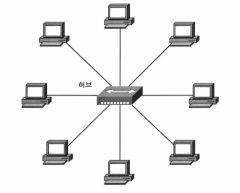
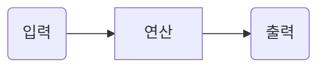
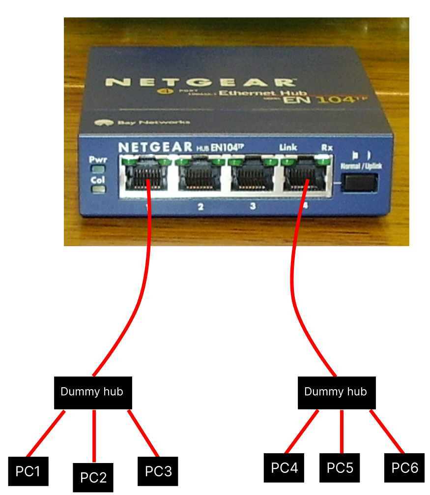

* 2024-12-04
* 출처: 강원대학교 최미정 교수님 네트워크 강의

# Network Device(네트워크 장비)

CS 분야는 여러가지가 있죠, Algorithm, Data Structure, Network, Database, OS... 여라가지 분야가 있지만 제 기준에서 Network가 가장 어려웠습니다. 왜냐면 Network는 실체라고 할게 없거든요. OS야 멘날 쓰는거고 Algorithm, Data Structure는 코드로 구현하면 되고, 요즘 백준 같은 사이트에서 문제를 여러개 풀면 감이 잡히는데 Network 같은 경운 이게 눈에 보이는게 아니잖아요? 그래서 예전부터 Network를 공부하기 전에 Device부터 알아보는게 맞지 않나 생각했습니다. 그래서 이번엔 Network Device에 대해서 알아보겠습니다.

이전 시간에서 알아봤듯, Network는 여러 계층으로 나뉘어져 있습니다. 그중 Application Layer, Transport Layer 는 각각 Application, OS가 담당하고 있는 영역이기 때문에 다루지 않을겁니다. 그 다음 계층인 Network Layer, Data Link Layer, Physical Layer 를 기준으로 Network Device를 간략하게 알아보겠습니다.

***

# Physical Layer
Physical Layer는 Network 신호를 다시 재생하고, 분배하는 역할을 합니다. 해당 Layer는 Computer의 역할이라기 보단 전자공학의 역역이기 때문에 해당 Layer에선 자세한 설명보단, 이런게 있구나- 정도만 알아두시면 될거 같습니다.

## 증폭기(Amplifier), 반복기(Repeater)
증폭기와 반복기는 <R>불분명해진 Network 신호를 다시 재생하는 역할</R>을 합니다. 지금 실시간으로 Youtube를 볼수 있는것도, 해당 Post를 볼수 있는것도 마법이 아니라 어떤 전기적 신호가 어딘가에서 지금 사용하고 있는 Computer로 전달되고 있기 때문일겁니다. 이때 이 신호가 시작점에서 끝점까지 아무런 힘의 손실 없이 온다는것은 절대 불가능 할겁니다. 그래서 이러한 신호들을 중간중간마다 증폭기와 반복기를 통해 신호를 다시 재생해줍니다. 어떻게 보면 Network를 연장하기 위한 장비라고도 볼수 있겠네요.
가끔 Amplifier와 Repeater를 혼동하는 경우가 있는데, **신호를 재생시켜준단점에서 둘은 같지만**, 엄밀히 따지면 서로 다른 장비 입니다.

증폭기(Amplifier)는 전기적 신호를 증폭시켜 주지만 중간에 있는 **Noise까지 같이 증폭**시켜 줍니다. 이러한 이유로 반복기(Repeater)보다 더 짧은 거리를 커버 할수 있습니다.

반대로 반복기(Repeater)는 **Noise를 제거 한후 신호를 재생**시켜 줍니다. 이러한 이유로 최근엔 반복기(Repeater) 가 모든 Network Device에 공통으로 들어가는 Deice가 되었습니다. 어떻게보면 Device 보단 이후에 말할 Switch에 탑재된 기능이라고 볼수도 있습니다.

## Dummy Hub
Hub는 <R>패킷을 모든곳에 똑같이 복사해서 보내는 역할을 수행</R>합니다. 그림으로 표현하면 아래와 같습니다. 주의할 점은 **Dummy hub 같은 경우 패킷을 모든곳에 똑같이 복사**해서 보냅니다. 한 지점에서 한 지점으로 패킷을 보내기 위해 <R>모든 지점으로 패킷을 복사해서 보내기 때문에 충돌(Collision)이 발생할 확률이 높습니다.</R> 충돌(Collision)이 발생하면 다시 패킷을 보내야 합니다.

***

# Data Link Layer
Layer을 계속 말하는건 너무 기니 이제부터 L1, L2 로 축약해서 말해보겠습니다. 위에서 소개한 Dummy Hub 는 그냥 딱 봐도 아.. 이거 못써먹겠다. 싶을 정도로 효율적이지 않은거 같습니다. L2에서 소개하게될 Device인 Bridge는 이러한 Dummy Hub의 단점을 보완하기 위해 나왔습니다. 또 Bridge도 극복할수 없는 한계가 있기 때문에 Bridge를 보완하기 위해 Switch가 나왔습니다. 근데 상기해야할것은 이 Device 모두 같은 동작을 한다는 겁니다.

## Bridge
Bridge는 L1 계층의 Dummy hub에서 발전한 L2 장비로서 <R>Hub간의 통신 지원 역할을 수행합니다.</R> 이때 Bridge에 들어오는 패킷(2계층이기 때문에 엄밀히 말하면 Frame)엔 출발지와 도착지의 MAC 주소를 가지고 있습니다. 이때 Bridge는 이 MAC 주소를 보고 패킷을 전달할지 말지를 결정합니다.

각 Port별로 대역폭을 보장하지만, 지원 포트 수는 2~4 포트 정도이고, 더 많은 포트를 지원하기 위해서는 다음에 소개할 Switch를 사용해야 합니다. 이 점이 바로 Bridge의 한계입니다.

여기서 Port 라는 단어가 나왔는데, 이전에 Port는 Process를 구분하기 위한 Address라고 했었죠? 근데 여기서 말하는 Port는 물리적인 Port로서 쉽게말해 그냥 **LAN선 꼽는 단자**를 말합니다. 엄밀하게 무엇이 Port다! 라는건 사실 정해진게 없어요, 그냥 맥락에 따라서 Port라는 단어가 다르게 사용될 뿐이니 너무 신경쓰지 않아도 될거 같습니다. Computer Science는 용어가 좀 중구난방이라 어쩔수가 없네요.

Bridge를 사용함으로써 어떻게 Dummy Hub의 단점을 극복했는지 간단한 에시 자료를 통해 알아보겠습니다. 해당 자료는 <B>PC1, PC2, PC3이 속하는 LAN1</B>이 존재하고 <G>PC4, PC5, PC6이 속하는 LAN2</G>가 존재한다고 가정합니다. 그리고 이러한 LAN을 연결하기 위해 Bridge가 사용되었습니다.

이때 PC1에서 PC3으로 데이터를 보내려고 한다 가정해 봅시다. 이전 Dummy Hub에선 <B>PC2, PC3</B>, <G>PC4, PC5, PC6</G> 모두에게 데이터를 보냈었지만, Bridge를 사용하여 중간에서 패킷을 차단하여 **<G>PC4, PC5, PC6</G> 에게는 데이터를 보내지 않습니다.** 이렇게 함으로써 Network의 효율성을 높일수 있습니다. 어떻게 보면 서로 다른 두 Network를 분리하는 역할을 수행한다고 볼수도 있겠네요.

정리하면 **Bridge 는 한 Network에서 다른 한 Network로 패킷을 복사할건지 말건지를 결정하는 역할을 수행한다.** 라고 할수 있겠네요.

이러한 과정이 실제로 어떻게 동작하게 되는지 자세히 보고 싶으시다면 아래 링크를 참고해주세요.

### 투명 브릿지(Transparent Bridge)
https://peemangit.tistory.com/8

### 소스 루트 브릿지(Source Route Bridge)

## L2 Switch
L2 Switch는 L2에서 작동하는 Switch를 뜻합니다. L2 Switch 가 있다는 말은 다른 Layer에서 작동하는 Switch도 있다는 뜻이겠죠? 나중에 한번에 정리해 보겠습니다.

기능적인 면에서 Dummy Hub, Bridge와 동일하지만 해당 Device들의 문제점들을 해결했기 때문에 현재 LAN 에 사용되는 Switch는 전부 L2 Switch를 사용한다 생각해도 무방합니다.

TODO: 복원 여부? 분리 가능 여부를 말하는건가?

| Device | 충돌영역 복원 여부 | 비고 |
|---|---|---|
| Hub | X | 패킷을 모든곳에 똑같이 복사해서 보냄, 연결된 모든 잘비들은 충돌영역에 속함 |
| Bridge | O | 패킷을 보낼지 말지를 결정, 충돌영역을 분리 가능, 포트의 수와 처리 능력에 한계가 존재 |
| Switch | O | Bridge에 비해 많은 Port를 지원, ARP를 통해 MAC 주소를 기반으로 충돌 영역 분리 가능 |

TODO: Bridge도 MAC 주소를 기반으로 분리하는거 아닌가?

결과적으로 위의 예제 그림을 Switch를 사용하여 다시 그려보면 아래와 같습니다.

TODO: 그림 필요

# Network Layer
L3의 대표적인 기능은 Routing 와 Packet Forwarding 입니다.

https://minyakk.tistory.com/45

L3의 대표적인 장비는 Router가 있습니다. Network를 구성하는 가장 중요한 장비라고 할수 있겠네요.

## Router
라우터는 어떻게보면 Network 를 구성하는 장비들중 가장 중요한 장비라고 할수 있습니다.

이름 그대로 길을 찾아주는 역할을 합니다. 이 모습이 마치 문을 열고 들어와 다시 여러 문들중 하나를 선택해 나가는것과 비슷해 Gateway 라고도 불립니다.

Bridge 처럼 Broadcast 를 차단하여 Network를 분리하기도 하며, 논리적으로 분리된 둘 이상의 Network를 연결하기도 하는 역할을 합니다.

가장 중요한 점은 각 Router 는 패킷의 최적 경로를 찾기 위한 Routing Table를 가지고 있습니다. 이 Routing Table은 각 Router가 가지고 있는 작은 DB라 볼수 있습니다. 이를 통해 패킷을 목적지 까지 가장 빠르게 보내는 길잡이 역할을 합니다.

TODO: 좀더 쉽게 글써야함, 소형 라우터, 대형 라우터 그림 포함해야함

학교로 예로 들면, 학교 전체를 커버하는 대형 Router가 존재하고 각 연구실에는 소형 Router가 있다 생각하면 될거 같습니다.

***

# 계층별 Switch
이전에 L2 Switch가 있다는 말은 다른 Layer에서 작동하는 Switch도 있다는 뜻이겠죠? 그럼 이번에는 각 계층별 Switch에 대해서 알아보겠습니다.

스위치는 계층별로 이렇게 나뉘어져 있습니다.

| 계층별 Switch |
|---|
| L2 Switch |
| L3 Switch |
| L4 Switch |
| L7 Switch |

https://aws-hyoh.tistory.com/65

L2 Switch는 이전에 봤으니 L3 Switch부터 알아보겠습니다. L3 는 Network Layer를 의미하죠? L3의 대표적인 기능은 Routing 와 Packet Forwarding 입니다. 그러므로 L3 Switch의 역할은 L3의 기능을 수행하는 Switch를 말합니다.

L4 Switch는 Transport Layer에서 동작하는 Switch를 말합니다. L4 Switch는 TCP/UDP를 기반으로 동작하며, Load Balancing 기능을 제공합니다.

Load Balancing은 Switch에 들어오는 트래픽을 조절하기 위해 포트별로 지정한 패킷을 처리하는 방식을 말합니다.

트래픽을 배분하여 전체적인 Network 성능을 유지하는 방법입니다.

TODO: 예로 들어, 서버가 하나 있다 가정해 보겠습니다. 해당 서버는 당연히 IP 주소를 가지고 있을겁니다. 이때 서버에서 1000 ~ 1200번 포트를 내부 서버로 연결하고, 나머지 포트는 외부로 연결한다고 가정해봅시다. 이런식으로 하나의 IP를 가지고 여러가지의 작업을 분류할수 있습니다. 이를 통해 서버의 부하를 분산할수 있습니다? 이 뭔소리야?

TODO: 내용 추가: 작은 숫자의 포트일수록 더 빠르게 처리하게 만들수도 있다.

L7 Switch 가 가장 비싸다

| 명칭 | 통신 방법 | 특징 | 비고 |
|---|---|---|---|
| L2 Switch | MAC 주소 기반 통신 | IP 줏에 대한 정보가 없어 라우팅 기능 제공 X | 허브와 달리 포트 별 대역폭 존재, 분리 가능 |
| L3 Switch | IP 기반 통신 | 라우팅 기능 제공(목적지 주소가 외부에 존재할 경우, 외부 라우터로 전송) | 라우터와 기능 유사, VLAN 기능 제공, 공유기 |
| L4 Switch | TCP/UDP | 로드 밸런싱(Load Balancing) 기능 제공 | 프로토콜을 구분하여 우선순위 설정 가능 |
| L7 Switch | 데이터기반 통신 | HTTP 의 URL, 또는 FTP의 파일명, 쿠기 정보, 틍정 바이러스의 배턴 등 보안 기능 제공 | L5 ~ L7 영역 포함 |

