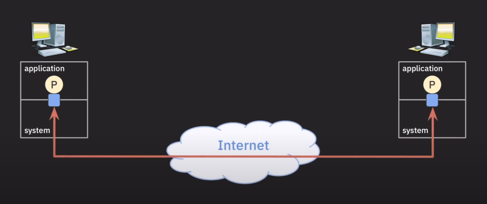

# TCP/IP Stack
지난번 주제에서 OSI 7계층에 대해서 알아보았습니다. 하지만 OSI 7계층은 네트워크 시스템 구성을 위한 범용적이고 개념적인 모델 이고, TCP/IP는 인터넷이 발명되면서 함께 개발된 Protocol Stack 입니다. 그러므로 실제 인터넷은 OSI 7계층이 아닌 TCP/IP Stack을 사용하고 있습니다.

개념과 그에 따르는 진짜 사실은 조금씩 다르다는것을 알아두시면 좋을거 같습니다. OSI7계층은 완전히 개념적인 모델이고, TCP/IP Stack은 실제로 사용되는 Protocol Stack입니다.

이 두개의 모델은 관리하는 주체또한 다릅니다. OSI 7계층은 ISO(국제표준화기구), IEC에서 관리하고 있고, TCP/IP Stack은 IETF(Internet Engineering Task Force)에서 관리하고 있습니다.

이 두개의 모델은 어느정도 호환성이 있습니다. 그러므로 OSI 7계층을 이해하고 있다면 TCP/IP Stack도 쉽게 이해할 수 있습니다. 한번 TCP/IP Stack에 대해서 알아보겠습니다.

| OSI 7 Layer         | TCP/IP Stack      |
|---------------------|-------------------|
| Application Layer   | Application Layer |
| Presentation Layer  |                   |
| Session Layer       |                   |
| Transport Layer     | Transport Layer   |
| Network Layer       | Internet Layer    |
| Data Link Layer     | Link Layer        |
| Physical Layer      |                   |

TCP/IP Stack은 이렇게 4개의 Layer로 구성돼어 있습니다. 그리고 이러한 Layer가 어느 위치에서 동작하는지에 따라 다시 2가지로 나눌수 있습니다.

| TCP/IP Stack | 동작 위치 |
|--------------|-----------|
| Application Layer | Application |
| Transport Layer | System |
| Internet Layer |  |
| Link Layer |  |

먼저 Sytem이 구현/관리 한단 의미는 하드웨어/펌웨어, OS레벨에서 구현/관리 됀다는 의미입니다. 이러한 Layer는 네트워크 기능을 지원하는것이 주 목적입니다.

Application Layer는 말 그대로 Application이 구현/관리 하는 Layer입니다. 따라서 이 Layer의 주 목적은 아래쪽에서 제공하는 Network 기능을 사용하는것이 주 목적이 있습니다.

TCP/IP를 더 자세하기 다루기 전 Socket과 Port에 대해서 알아보겠습니다. Socket과 Port또한 TCP/IP가 개발돼는 과정에서 나온 개념들이기 때문에 Protocol이 Socket과 Port를 어떻게 정의했는지 알아봅시다.

***

# Port
Socket을 알아보기전 TCP/IP Stack이 활발하게 개발된 시기인 1970 ~ 1980년대로 돌아가 보겠습니다. 이때는 TCP/IP가 완전히 정립되지 않았기 때문에, 여러 개념들이 나오던 시기였는데요 이제 한번 이때사람들이 했던 고민을 알아보겠습니다.

첫번째로, System상에서 동작하는 어떠한 ProcessA가 인터넷 상의 또다른 ProcessB와 데이터를 주고받고 싶다면 ProcessA와 System이 어떻게 통신할 어떠한 데이터 통로가 있어야 할것입니다. 그래야 System이 ProcessB가 속한 System에 데이터를 전송할 수 있을것입니다. 이렇게 Process와 연결ehls data path 혹은 data channel을 Port라 부릅니다.

[5:07](https://youtu.be/X73Jl2nsqiE?si=xkpj8S_GHpO4F48_)

또 한 System은 여러개의 Process를 포함하는 경우가 많습니다. 그러므로 Port 또한 여러개 존재 하고 각 Process는 Port를 통해 데이터를 주고 받습니다. 이때 Port는 16bit로 표현되며, 0 ~ 65535까지 사용할 수 있습니다. 이때 0 ~ 1023까지는 Well-Known Port라고 불리며, 1024 ~ 49151까지는 Registered Port, 49152 ~ 65535까지는 Dynamic Port라고 불립니다.

## TCP Protocol의 필요성
이제 Port에 대해서 알아보았으니, 이 지식을 바탕으로 1970 ~ 1980년대로 돌아가 당시 네트워크를 연구하던 과학자들이 어떠한 고민을 했는지 알아보겠습니다. 먼저 위와 마찬가지로 ProcessA와 ProcessB가 데이터를 주고 받는 상황을 가정해보겠습니다. 현재 TCP/IP Stack에서 고려돼어 있는 부분은 다음과 같습니다.

| TCP/IP Stack | 동작 위치 |
|--------------|-----------|
| Application Layer | Application |
| Internet Layer | System |
| Link Layer |  |

두 Process가 있고 Process는 System과 Port로 연결돼어 있습니다. 이제 Internet Layer에서 두 호스트 사이의 최적의 경로를 결정하고, Link Layer에서 물리적인 연결을 담당합니다. 이때 두 Process가 데이터를 주고 받기 위해서는 어떠한 프로토콜이 필요할까요? 이때 TCP가 필요합니다. 이때 Internet Layer에서는 Internet Protocol(IP)를 사용하고, Link Layer에서는 Ethernet을 사용합니다.

하지만 Internet Protocol에는 중요한 특징이 있습니다. 이 프로토콜은 unreable한 프로토콜입니다. 즉, 데이터를 전송할때 데이터가 손실되거나, 보내는 순서대로 받는쪽에서 받지 못할수도 있습니다. Internet Protol은 하나의 Host에서 다른 Host로 데이터를 보내기 위해 최선을 다하겠지만 100%안전을 보장할수 없습니다. 이러한 특징은 지금도 유지되고 있습니다.

그렇기에 Process간의 통신에서 데이터를 realiable하게 주고 받을 수 있는 Protocol이 필요합니다. 그 결과로 TCP(transmission Control protocol)이 개발되었습니다. TCP는 데이터를 전송할때 데이터가 손실되거나, 순서가 뒤바뀌는 문제를 해결하기 위해 만들어진 프로토콜입니다. TCP는 IP위에서 동작하는 Protocol이지만 논리적인 방법을 통해 실제 Process간 통신 이 안정적으로 이루어지도록 합니다.

***

# TCP
이제 TCP에 대해 좀더 자세히 살펴보겠습니다. 먼저 Connection에 대한 개념부터 살펴보겠습니다

## Connection
Connection은 사전적인 의미론 연결이란 뜻을 가지지만 TCP에서 Connection이란 좀더 구체적인 의미를 가지고 있습니다. TCP에서의 Connection은 **Process간의 안정적이고 논리적인 통신 통로**를 의미합니다. 여기서 논리적인 이란 의미는 그냥 단순하게 코드로 만들어진 통로 라는 의미라 생각해도 될거 같습니다.

## Three-way Handshake
이제 Connection의 개념에 대해 알아보았으니 TCP가 어떻게 통신을 하는지 알아보겠습니다. 먼저 TCP 통신을 하기 위해 두 Process는 Connection을 맺어야 합니다. 이때 Connection을 맺기 위해 Three-way Handshake라는 과정을 거칩니다. Connection이 맺어지게 돼면 두 Process는 이 Connection 위에서 데이터를 주도 받을 수 있습니다.

Tree-way Handshake를 하는 이유는 두 Process가 안정적으로 데이터를 주고 받기 위한 Set up 과정이라 생각하면 될거 같습니다.

그리고 통신이 끝나면 Connection을 종료해야 합니다. 이때 Connection을 종료하기 위해 Four-way Handshake라는 과정을 거칩니다. 이 과정을 통해 Connection이 안전하게 종료될 수 있습니다.

Four-way Handshake를 하는 이유는 두 Process가 System으로부터 할당받은 여러 자원들을 반환하기 위한 과정이라 생각하면 될거 같습니다.

가끔 어떠한 Protocol을 살펴보면 Connection-oriented Protocol이라는 용어를 볼수 있습니다. 이때 Connection-oriented Protocol이란 Connection을 맺고 데이터를 주고 받는 Protocol을 의미합니다. TCP는 Connection-oriented Protocol이기 때문에 Three-way Handshake와 Four-way Handshake를 통해 Connection을 맺고 종료합니다.

