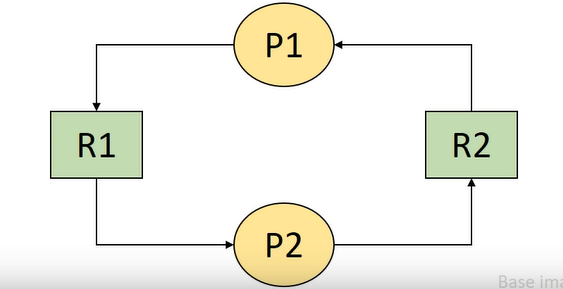

# Deadlock
무슨뜻인지 한번 예상해보면 좋을거 같습니다. 무언가 죽었다, 혹은 걸려있다 라는 뜻 같은데요. 아래 이미지를 보면 무슨 뜻인지 한번 알 수 있을거 같습니다. 뭐 하나도 이루어지지 않고 그 누구도 지나가짐 못하는 이상한 상황, 이러한 이미지를 생각해보면 이해가 될거 같습니다.

저번에 배웠단 process state diagram을 다시 보면 이러한 상태가 있었습니다. **Blocked state**, **Asleep state**가 있었습니다. 이 두 상태는 프로세스가 Processor가 아닌 다른 자원 혹은 이벤트(I/O)를 기다리는 상태입니다.

근데 여기서 중요한 것은 Process가 발생 가능성이 없는 이벤트를 기다리는 경우가 발생할 수 있습니다. 이 상태일때 그 Process를 우린 Deadlock 상태에 빠졌다 라고 부릅니다. 또한 그 시스템 또한 deadlock 상태에 있다 합니다.

근데 이렇게 생각해볼수 있을거 같습니다. 이전에 배웠던 기아상태와 deadlock 상태가 굉장히 유사하다고요, 그래서 한번 두 상태를 비요해 보겠습니다.

## 기아상태와 Deadlock 상태의 차이
deadlock 상태는 어떤 상태에 존재한다고 했었죠? 바로 asleep상태, 즉 running상태에서 block돼었을때 asleep상태서 자원 혹은 event를 기다리는데 이것들이 가능성이 없는상태 입니다.

근데 기아상태는 어떨까요? 기아상태는 어떤 프로세스가 Processor을 기다리는데 계속 Processor를 할당받지 못하는 상태입니다. 고로 ready 상태에서 기아가 발생합니다. 또 이러한 기아는 절대 Processor를 할당받지 못하는 상태가 아니라 그저 운이 없어서 Processor를 할당받지 못하는 상태입니다.

결론적으로 어떤 자원을 기다리는지, 기다리는 자원의 가능성, 이러한 상태가 발생하는 장소가 다릅니다.

## 자원의 분류
Deadlock을 예기하면서 계속 자원이란 단어가 나왔습니다. Deadlock은 자원과 굉장히 밀접한 관계가 있습니다. 그래서 자원을 분류해보겠습니다.

앞서 자원을 두가지로 구분해 봤습니다. Hardware resources와 Software resources로 나누었습니다. 너무나도 잘 아는 분류법이죠. 하지만 Deadlock이라는 관점에서 자원을 구분해보면 이렇게도 나눌 수 있습니다.

### 선점 가능 여부에 따른 분류
선점, 즉 다른애가 내가 쓰고있는 자원을 빼앗을수 있단 예기 입니다. 빼앗기고 다시 돌아와도 문제가 발행하지 않는 자원을 Premmptible resources 라고 합니다. 이러한 자원에는 Processor, memory 등이 있습니다.

반대로 선점당하면, 이후 진행에 문제가 발생하는 자원을 Nonpremmptible resources 라고 합니다. 이러한 자원에는 Disk, Printer 등이 있습니다. 어떤 disk가 있는 경우 이곳에 데이터를 기록하고 있는데 어떠한 이유로 인해 선점당하면 이후에 문제가 발생할 수 있습니다.

### 할당 단위에 따른 분류
크게 두가지로 나뉘어 지는데요, 첫번째로 Total allocation resources 입니다. 이름 그대로 자원 전체를 Process에게 할당해주는 자원입니다. 이러한 자원에는 Processor(멀티코어 Processor라면 다르겠지만 일단 싱글코어라고 생각해봅시다), disk drive 등이 있습니다. disk drive 또한 위에서 말한 문제 때문에 한번에 한 Process만 쓸수 있게 해야 합니다.

두번째인 Partial allocation resources 입니다. 하나의 자원을 여러 조각으로 나누어 여러 Process에게 할당 가능한 자원입니다. 이러한 자원에는 대표적으로 Main Memory가 있습니다.

### 동시 사용 가능 여부에 따른 분류
이제 감이 오시나요? 이것도 크게 두가지로 나뉘어 집니다. 첫번째로 Exclusive allocation resources 입니다. 이러한 자원은 한번에 한 Process만 사용 가능한 자원입니다. 이러한 자원에는 Processor, disk drive가 있습니다. 그리고 추가적으로 Main memory도 있습니다.

Main memory가 있어 좀 햇갈릴 수 있습니다. 이렇게 생각하면 됩니다. 위에서 Main memory를 여러개로 조각내어 여러 Process에게 할당 가능하다고 했었죠? 그렇다면 이 잘라진 한 영역, ProcessA에게 할당된 잘라진 Main memory의 한 영역은 ProcessA많이 사용 가능한 자원이 됩니다. 이러한 뜻입니다.

두번째로는 Shareable allocation resources 입니다. 이러한 자원은 여러 Process가 동시에 사용 가능한 자원입니다. 이러한 자원에는 Program이 있습니다. 이때 Program은 간단히 말해 그냥 코드라고 생각하시면 됩니다. 크롬 브라우저를 여러개 켜도 문제가 없는 이유가 이러한 자원이 Shareable allocation resources에 속하기 때문입니다. 또 이전에 배웠던 shared data 또한 이에 속합니다.

### 재사용 가능 여부에 따른 분류
이것도 크게 두가지로 나뉘어 집니다. 첫번째로 Serially-reusable Resources 입니다. 이러한 자원은 계속 쓸수 있는 자원이란 의미를 가집니다. 시스템 내에 항상 존재 하는 자원을 의미합니다. 또한 사용이 끝나면, 다른 Process가 사용 가능하단 특징도 있습니다. 이러한 자원에는 Processor, disk drive, program, memory 등이 있습니다.

두번째로 Consumable Resources가 있습니다. 이러한 자원은 한 Process가 사용한 후에 사라지는 자원을 의미합니다. 쉽게 생각해 Process끼리의 signal, message 등이 있습니다.

## Deadlock과 자원의 종류
이렇데 분류한 자원들중 Deadlock을 발생시킬수 있는 자원은 무엇이 있을까요? 차례대로 알아보겠습니다.

1. Nonpremmptible resources
    * 예를들어 어떤 ProcessA가 Disk를 사용하고 있는데, ProcessB도 Disk를 쓰고싶다 가정해 보겠습니다. 이때 ProcessB는 Disk를 쓰지 못하니 Deadlock이 발생 할 수 있습니다, 만약 ProcessB가 Disk를 빼앗을수 있다면 Deadlock이 발생하지 않겠죠.
2. Exclusive allocation resources
    * 한번에 한 Process만 사용 가능한 자원입니다. 이러한 자원은 한 Process가 사용중일때 다른 Process가 사용하려고 하면 Deadlock이 발생할 수 있습니다.
3. Serially-reusable Resources
    * 둘다 Deadlock의 가능성이 존재 합니다. Serially-reusable Resources는 계속 쓸수 있는 자원이라고 했었죠. 이러한 자원은 한 Process가 사용중일때 다른 Process가 사용하려고 하면 Deadlock이 발생할 수 있습니다.
    * Consumable Resources 또한 Deadlock의 가능성이 존재 하지만, 있고 없고까지 Deadlock을 방지시키기 위해선 문제가 매우 복잡해 지기 때문에 고려하지 않습니다.
4. 할당 단위는 Deadlock을 발생시키지 않습니다.
    * 혼자 쓸수 있는 자원이여도 Premmptible하면 문제가 돼지 않습니다. 나누어쓰는것 또한 그 자체로 문제가 되지 않습니다.

결론적으로 Nonpremmptible, Exclusive 한 자원이 대표적인 Deadlock을 발생시키는 자원이라고 정리할 수 있겠습니다.

***

# Deadlock의 발생의 예
이전까지 Deadlock에 대해 알아보았습니다. 이제는 Deadlock 의 실제 발생하는 예를 알아보겠습니다. 가정은 다음과 같습니다. 현재 P1와 P2라는 Process, R1, R2라는 Resource가 있다고 가정해 보겠습니다. 다음 표는 시간에 따라(t1 ~ t11) 어떠한 일이 일어나는지에 대한 테이블 입니다.

| P1         | 시간 | P2         |
|:----------:|:----:|:----------:|
| ...        | t1   | ...        |
| request R2 | t2   | ...        |
| ...        | t3   | request R1 |
| request R1 | t4   | ...        |
| ...        | t5   | request R2 |
| ...        | t6   | ...        |
| release R1 | t7   | ...        |
| ...        | t8   | release R1 |
| release R2 | t9   | ...        |
| ...        | t10  | release R2 |
| ...        | t11  | ...        |

1. t2 에서 P1이 R2을 요청해 가져갔습니다.
2. t3 에서 P2가 R1을 요청해 가져갔습니다.
3. t4 에서 P1이 R1을 요청했지만 P2가 R1을 사용하고 있습니다.
    * 현재 P2가 사용하고있는 R1을 P1이 요청했습니다. 하지만 아직 Deadlock이라고 말하긴 힘든 상태입니다. P2가 R1을 사용하고 반환하면 P1이 R1을 사용할 수 있기 때문입니다.
4. t5 에서 P2이 R2을 요청했지만 P1이 R2을 사용하고 있습니다.
    * [P2 -> R2 요청, P1 -> R2 사용 중], [P1 -> R1 요청, P2 -> R1 사용 중] 서로 가진걸 요청하고 있는 상태입니다. 이때 Deadlock이 발생합니다.

매우 간단한 예제인만큼 어쩌면 와닫지 않을수 있습니다. 이제 이러한 Deadlock을 표현하는 방법을 알아보겠습니다.

## Graph Model
먼저 Graph Model입니다. 자료구조 시간에 배웠던 그 Graph입니다. 먼저 Graph는 Node와 Edge로 이루어져 있습니다. 이때 Node는 Process, Resource를 의미하고 Edge는 Process가 Resource를 요청하는 것을 의미합니다.

해당 그림을 보시면 R2에서 P1으로 가는 화살표가 있습니다. 이는 P1이 R2를 할당받은 상태라는 뜻입니다. 반대로 P1이 R1으로 가는 화살표는 P1이 R1을 요청한 상태라는 뜻입니다.

해당 그림은 위의 테이블을 그림으로 표현한 것입니다. 순서와 함께 생각해보면, R2에서 P1이 가는 화살표가 1번, R1에서 P2로 가는 화살표가 2번, P1에서 R1으로 가는 화살표가 3번입니다. 여기까지는 아직 Deadlock이 아닙니다. 하지만 P2이 R2를 요청하는 4번 화살표가 생길시 Deadlock이 발생합니다. 즉 Process와 Resource 끼리 Graph Model을 통해 표현할시 Cycle이 생기면 Deadlock이 발생한다고 할 수 있습니다.

## State Transition Model
이번엔 다른 예제와 함께 살펴보겠습니다. 예제는 다음과 같습니다.

* 2개의 Process와 A type의 자원이 2개 존재(Ra, Ra)
* Process는 한번에 하나만 요청/반납 가능

TODO: 이후 작성

## Deadlock 발생 필요 요건
이제 결론적으로 Deadlock이 발생하기 위한 필요 요건을 알아보겠습니다. 필요요건 이라 하면, 아래에서 소개할 4가지의 요건을 모두 만족해야만 Deadlock이 발생한다는 뜻입니다. 또한 이러한 4가지의 요건은 2가지로 또 나눌수 있습니다.

### Deadlock이 발생하기 위한 자원의 특성
Deadlock이 발생하기 위해선 자원들은 Exclusive use of resources, Non-preemptible resources 특성을 가져야 합니다. 복습하자만 한번에 한 Process만 사용 가능하면서, 중간에 빼앗기면 안돼는 자원이라는 뜻입니다.

### Deadlock이 발생하기 위한 프로세스의 특성
Hold and wait, Circular wait 특성을 가져야 합니다. Hold and wait(Partial allocation)는 말 그대로, 현재 어느 Resource는 잡고 있으면서 다른 Resource를 요청하는 상태입니다. Circular wait는 이전 모델에서 봤던대로 Cycle이 생기는 상태입니다.

