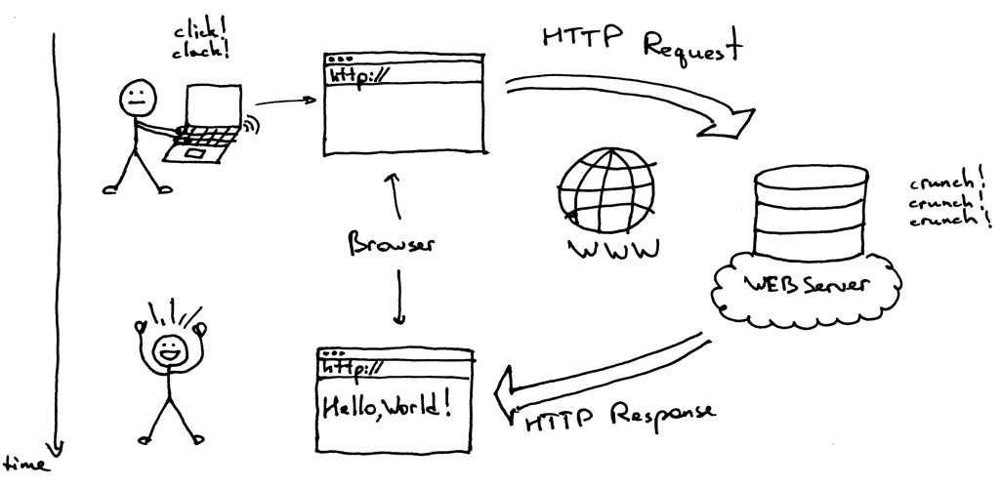

# What is Server?
서버가 무엇일까요? 사실 서버가 무엇이냐 물어보는건 마치 인간은 무엇이냐 라고 물어보는 것과 같다 생각합니다. 인간이 무엇이라 하면.. 그냥 인간이요 할수도 있고 유기체라고 할수도 있고 생각하는 존재 라고 할수도 있고.. 여러 해석이 나오잖아요?

서버도 마찬가집니다. Html, css, js 파일을 제공하는 서버도 있고 데이터베이스를 제공하는 서버도 있고... Python이나, Java로 만들수 있는 프로그램이 무한에 가깝듯 서버또한 어떻게 만드는지에 따라 다양한 종류가 있습니다. 공통적으론 클라이언트(사용자)의 요청에 대한 응답을 하는 역할을 수행한단 점이 있습니다.

# What is Web Server?
그렇다면 웹서버가 무엇일까요?



간단히 말해, Http 프로토콜을 통해 이루어지는 클라이언트와 서버간의 통신이라 할수 있습니다. 이때 클라이언트는 브라우저일 수도 있고, HTTP를 사용하는 어떤 다른 소프트웨어 일수도 있습니다.

그렇다면 아주 간단한 웹서버는 어떻게 만들수 있을까요? 다음은 원 저자가 제시한 간단한 웹서버 코드 입니다. Python 3.7+ 에서 테스트가 완료 되었습니다. 저같은 경우는 Python 3.11.7 버전을 사용하고 있습니다.

```python
# Python3.7+
# Python3.11.7
import socket

HOST, PORT = '', 8888

listen_socket = socket.socket(socket.AF_INET, socket.SOCK_STREAM)
listen_socket.setsockopt(socket.SOL_SOCKET, socket.SO_REUSEADDR, 1)
listen_socket.bind((HOST, PORT))
listen_socket.listen(1)
print(f'Serving HTTP on port {PORT} ...')
while True:
    client_connection, client_address = listen_socket.accept()
    request_data = client_connection.recv(1024)
    print(request_data.decode('utf-8'))

    http_response = b"""\
HTTP/1.1 200 OK

Hello, World!
"""
    client_connection.sendall(http_response)
    client_connection.close()
```

해당 코드를 저장하고 실행하면 이러한 모습이여야 합니다.

```bash
$ python webserver1.py
Serving HTTP on port 8888 …
```

정상적인 실행이 되었다면 브라우저에 `http://localhost:8888/hello` 를 입력해보세요. 그럼 브라우저에 `Hello, World!` 라는 글자가 나타날겁니다! 와우!

