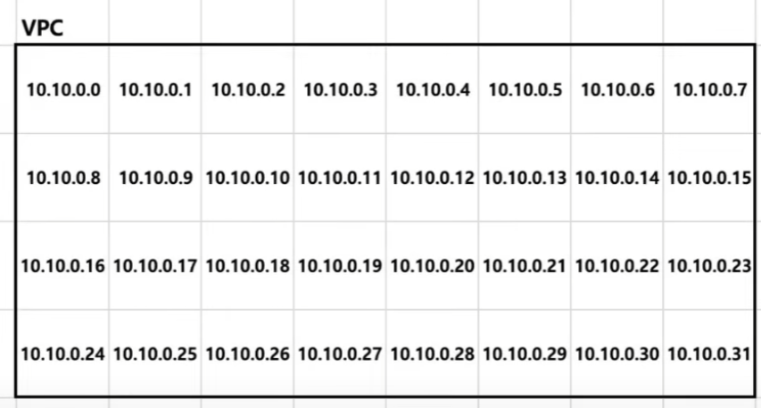
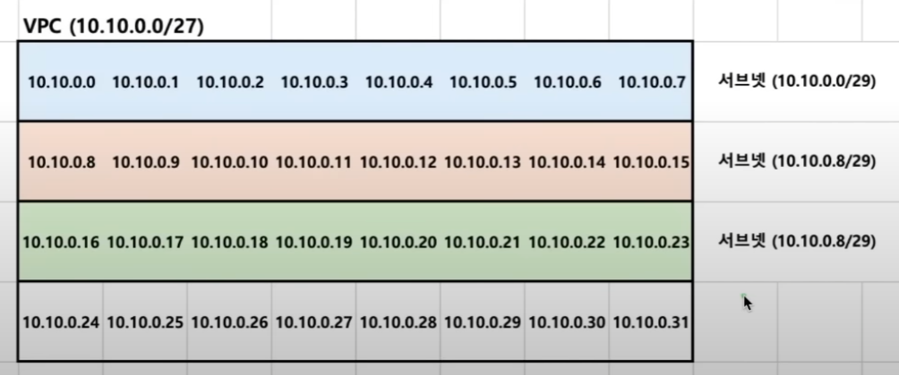
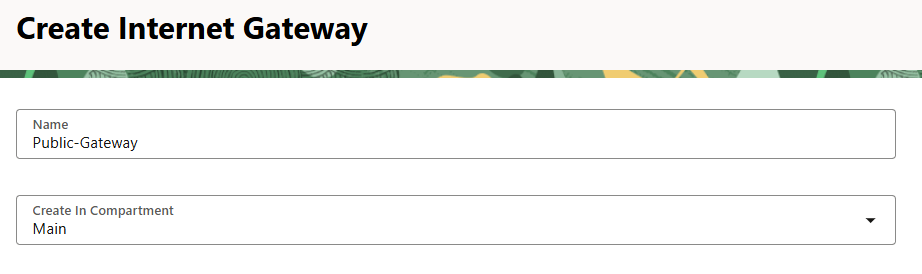

# OCI 인스턴스 생성 순서
1. Compartment 생성 → 조직, 프로젝트, 팀 등으로 나누기
2. VCN 생성
    1. 서브넷 생성
    2. 인터넷 게이트웨이 생성
    3. 라우팅 테이블 생성
3. 인스턴스 생성

# Virtual Cloud Network (VCN)
* VCN은 Virtual Cloud Network의 약자로, OCI에서 제공하는 가상 네트워크
* 외부에서 직접 접근할 수 없는 독립적인 네트워크 환경울 구성 가능
* 가장 큰 장점은 **보안**

예를들어, 이렇게 설계가 가능하다.

* 한 VCN 은 여러 Instance 를 가질수 있다.
* 이 여러 Instance 들중 하나만 외부에서 접근 가능
* 다른 Instance 들은 외부에서 접근 불가능

* VCN 공간에 할당할수 있는 IP 들을 가지고 있는걸 볼 수 있다. 해당 IP 들에 Resource 들을 할당하는 방식으로 사용
* VCN 을 생성할때는 CIDR 블록을 지정해야 한다.
* CIDR 블록은 VCN 내에서 사용할 수 있는 IP 주소 범위를 정의한다.

OCI 에선 한 VCN 을 정의하면 Default Route Table, Default Security List, Default DHCP Options 가 자동으로 생성된다.

# CIDR Block
위의 VCN 을 만들기 위해선 Network 의 크기를 정해야 한다. 이때 사용하는것이 CIDR

예를들어 위 그림처럼 VCN 을 구성하기 위해선 `10.10.0.0 ~ 10.10.0.31` 로 설정 해야 한다. 이때 CIDR 표기방식 은 `10.10.0.0/27` 라 표현

* `10.10.0.0 ~ 10.10.0.31` = `10.10.0.0/27`

해석법 (`13.25.82.0/24`)

1. 2진수로 변환
    - `00001101.00011001.01010010.00000000`
2. 슬래시 뒤에 있는 숫자 만큼 자름
    - `00001101.00011001.01010010 / 00000000`
3. 오른쪽 값에서 표현할 수 있는 최솟값과 최댓값을 구함
    - 최솟값: `00001101.00011001.01010010.00000000`
    - 최댓값: `00001101.00011001.01010010.11111111`
4. 다시 10진수로 변환
    - 최솟값: `13.25.82.0`
    - 최댓값: `13.25.82.225`

결과 : `13.25.82.0/24` = `13.25.82.0 ~ 13.25.82.225`

# Public IP vs Private IP
* Public IP
    - 인터넷에서 접근 가능한 IP
    - 전세계에 딱 하나만 존재
* Private IP
    - 내부 네트워크에서만 사용되는 주소
    - 같은 공유기를 사용하는 경우, 같은 VCN 인 경우 서로 통신 가능

IETF 에서 정의한 Private IP 대역

| RFC1918 이름 | Private IP 주소 범위 | 호스트 ID 크기 |
| ------------|------------------ | -------------- |
| 24-bit block | 10.0.0.0 ~ 10.255.255.255 | 24비트 |
| 20-bit block | 172.16.0.0 ~ 172.31.255.255 | 20비트 |
| 16-bit block | 192.168.0.0 ~ 192.168.255.255 | 16비트 |

보통 VCN 을 만들때 `10.0.0.0/16` 을 많이 사용한다. 그 이유는
* VCN 의 크기를 정의할땐 Private IP 대역에 포함된 CIDR 블록을 사용해야 함
* 충분한 IP 개수를 가지고 있음, 총 65536 개
* `10.0.0.0/16` 생긴게 깔끔함

# Subnet
* VCN 같은 하나의 큰 네트워크를 작은 네트워크로 나눈것
* 하나의 VCN 안에 DB 네티워크와 백엔드 네트워크를 분리 하는것이 가능
* Public 서브넷과 Private 서브넷으로 나누는것이 가능
    * Public 서브넷 → 외부 접근 가능
    * Private 서브넷 → 외부 접근 불가능

위 VCN 예시에서 서브넷을 만들면 다음과 같이 만들수 있다.
* `10.0.1.0/24` → Public 서브넷
* `10.0.2.0/24` → Private 서브넷

* Subnet 을 만들땐 어떤 Security List 를 사용할지, 어떤 Route Table 을 사용할지 선택할 수 있다.
* PublicIP 와 Security List 를 통해 Inbound 트래픽을 제어 가능

# Gateway
* Public Subnet 을 만들어도 Outbound 트래픽을 허용하지 않으면 외부로 나갈 수 없어, 통신이 불가능
* Internet Gateway 는 외부 인터넷 간에 통신할 수 있게 해주는 장치

Gateway 는 Compartment 에 하나씩 할당해도 충분

# Routing Table
* 외부와 연결하기 위해 한가지 더 필요한것은 라우팅 테이블
* Routing Table 은 트래픽을 어디로 전송해야 하는지 경로를 알려주는 테이블
* Route Table 을 통해 Outbound 트래픽 흐름을 조정해야 완전한 인터넷 연결이 가능
* Route Table 은 Subnet 을 만들때 선택 가능

# OCI 아키텍처 정리
1. VCN
2. Gateway
3. Routing Table
4. Subnet
5. Instance

* Inbound 트래픽은 PublicIP, Security List 를 통해 제어
* Outbound 트래픽은 Gateway, Routing Table 을 통해 제어
