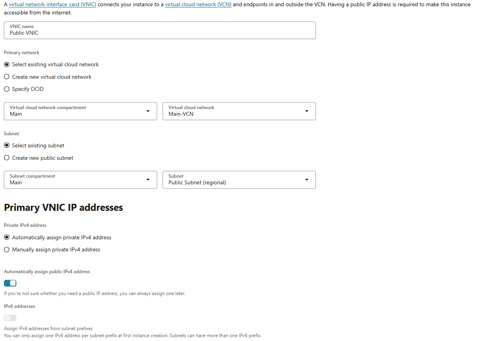

# Instance
Instance 를 설정하기 위해 OS 와 Hardware 를 선택

그 후 Network 설정을 해야 함



1. VNIC
    - VM 과 VCN 을 연결해주는 네트워크 인터페이스
    - Instance 는 VNIC 을 통해 VCN 안의 다른 리소스들과 통신하거나, VCN 바깥의 외부 인터넷과도 통신
    - 퍼블릭 IP는 이 VNIC에 부여
    - VM 의 유선 랜포트 라 이해해도 무방

2. Primary Network
    - 인스턴스가 어떤 가상 네트워크 상에 존재할지를 결정

3. Subnet
    - 인스턴스를 어느 서브넷에 연결할지 선택
4. Primary VNIC IP addresses
    - 프라이빗 IP를 자동으로 할당할지, 직접 지정할지 설정
    - 대부분의 경우 Automatically assign으로 두면 됨 (기본값)
5. Automatically assign public IPv4 address
    - 인스턴스에 퍼블릭 IP를 자동으로 할당할지 설정
    - 이걸 켜야 인스턴스가 퍼블릭 IP를 받아서 인터넷에서 접근 가능
6. IPv6 addresses
    - 서브넷이 IPv6를 지원할 경우에만 사용 가능

이 후 부트볼륨 을 선택하고 마무리

# 연결
username 은 기본적으로 ubuntu 라는걸 알아두자

```bash
ssh -i ssh-key-20xx-xx-xx.key ubuntu@public-ip-address
```

# 가상메모리
```bash
ubuntu@public-instance:~$ free -h
               total        used        free      shared  buff/cache   available
Mem:           956Mi       350Mi       157Mi       1.1Mi       600Mi       606Mi
Swap:             0B          0B          0B
ubuntu@public-instance:~$ sudo fallocate -l 2G /swapfile
ubuntu@public-instance:~$ sudo chmod 600 /swapfile
ubuntu@public-instance:~$ sudo mkswap /swapfile
Setting up swapspace version 1, size = 2 GiB (2147479552 bytes)
no label, UUID=4ee9e3b7-6dd3-4bc9-963c-814b3bd58df9
ubuntu@public-instance:~$ sudo swapon /swapfile
ubuntu@public-instance:~$ sudo swapon --show
NAME      TYPE SIZE USED PRIO
/swapfile file   2G   0B   -2
ubuntu@public-instance:~$ free -h
               total        used        free      shared  buff/cache   available
Mem:           956Mi       352Mi       154Mi       1.1Mi       601Mi       604Mi
Swap:          2.0Gi          0B       2.0Gi
```