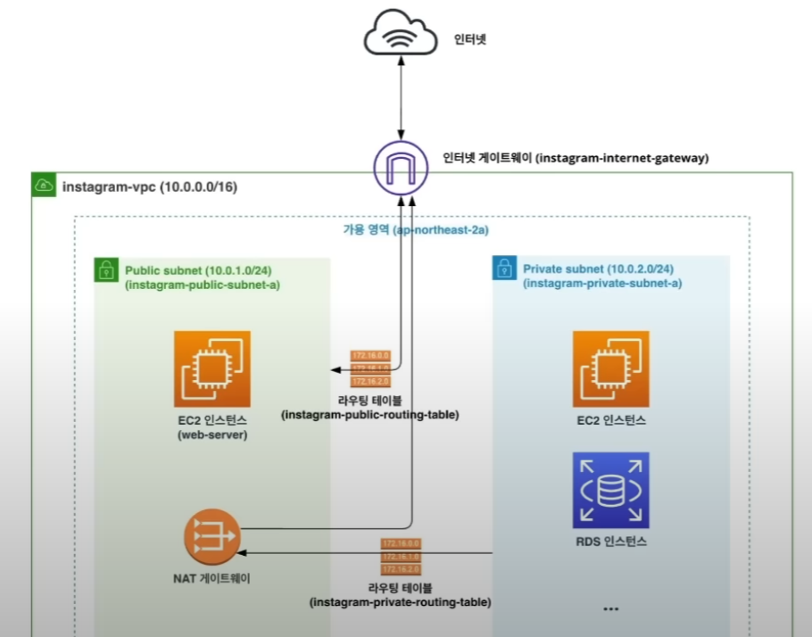
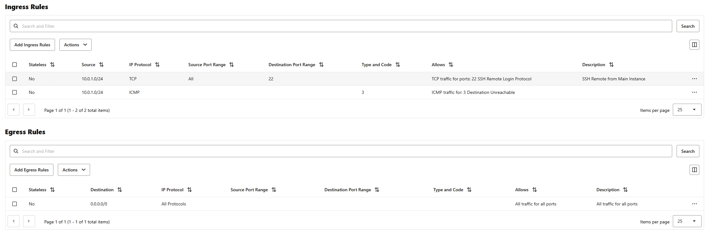
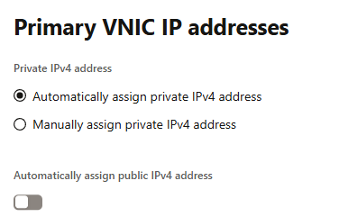

# Private Instance
이전 섹션의 목표는 퍼블릭 인스턴스에 접속하기 위해 퍼블릭 Subnet과 Internet Gateway, Route Table 을 세팅

하지만 프로이빗 Subnet에선 보안을 위해 Internet Gateway를 세팅하면 안되는 문제가 발생


# NAT Gateway
NAT Gateway는 Subnet에서 외부 인터넷으로 접근 가능하게 해주는 장치

Gateway 와는 다르게 NAT Gateway는 Outbound 트래픽만 허용하고 Inbound 트래픽은 허용하지 않음

* Internet Gateway: 외부 인터넷 ↔ Subnet
    - SSH, HTTP, HTTPS
* NAT Gateway: Subnet → 외부 인터넷
    - git clone, apt update

이러한 NAT Gateway 는 **퍼블릭 Subnet 에 연결**을 해야 한다

아래 사진은 구조도



하지만 아쉽게도 OCI Free Tier 에선 NAT Gateway를 제공하지 않음

# Security List
Security List는 Subnet에 연결된 리소스에 대한 Inbound, Outbound 트래픽을 제어하는 역할

Ingress Rule 과 Egress Rule 로 나뉘어져 있음
* Ingress Rule: Subnet으로 들어오는 트래픽 제어
* Egress Rule: Subnet에서 나가는 트래픽 제어

이 Security List 를 특정 Private IP 대역만 허용하도록 설정해, 내부 인스턴스끼리만 통신할 수 있도록 설정 가능



ICMP 프로토콜을 허용하는 이유
* 상대 호스트가 살아 있는지 확인, `ping`
* 패킷이 거치는 라우터 확인, `traceroute`
* 목적지에 도달 불가 등 알려줌
* 패킷이 너무 클 때 알림
* 라우터가 자신을 브로드캐스트
* 위 사진에선 3이지만 8로 설정해줘야 ICMP Echo Request 가 가능

# Instance
위 Security List를 설정한 후, 특정 서브넷에 연결 한 후 Intance 생성

Instance 생성시 아래 사진처럼 `Automatically assign public IPv4 address` 옵션을 **비활성화** 해야 함



이로써, 외부에선 public ip 와 security list 에 막혀 접근 할 수 없지만, 내부 Instance 끼리는 통신이 가능한 Private Instance 가 생성됨

그리고 이렇게 만들어진 Private Instance 는 외부와 통신이 가능

```bash
ubuntu@public-instance:~$ ping 10.0.8.888
PING 10.0.8.888 (10.0.8.888) 56(84) bytes of data.
64 bytes from 10.0.8.888: icmp_seq=1 ttl=64 time=0.896 ms
64 bytes from 10.0.8.888: icmp_seq=2 ttl=64 time=0.465 ms
64 bytes from 10.0.8.888: icmp_seq=3 ttl=64 time=0.408 ms
64 bytes from 10.0.8.888: icmp_seq=4 ttl=64 time=0.417 ms
64 bytes from 10.0.8.888: icmp_seq=5 ttl=64 time=0.432 ms
64 bytes from 10.0.8.888: icmp_seq=6 ttl=64 time=0.448 ms
64 bytes from 10.0.8.888: icmp_seq=7 ttl=64 time=0.426 ms
64 bytes from 10.0.8.888: icmp_seq=8 ttl=64 time=0.415 ms
64 bytes from 10.0.8.888: icmp_seq=9 ttl=64 time=0.461 ms
64 bytes from 10.0.8.888: icmp_seq=10 ttl=64 time=0.442 ms
64 bytes from 10.0.8.888: icmp_seq=11 ttl=64 time=0.431 ms
64 bytes from 10.0.8.888: icmp_seq=12 ttl=64 time=0.527 ms
64 bytes from 10.0.8.888: icmp_seq=13 ttl=64 time=0.455 ms
64 bytes from 10.0.8.888: icmp_seq=14 ttl=64 time=0.449 ms
64 bytes from 10.0.8.888: icmp_seq=15 ttl=64 time=0.415 ms
64 bytes from 10.0.8.888: icmp_seq=16 ttl=64 time=0.432 ms
64 bytes from 10.0.8.888: icmp_seq=17 ttl=64 time=0.479 ms
64 bytes from 10.0.8.888: icmp_seq=18 ttl=64 time=0.422 ms
64 bytes from 10.0.8.888: icmp_seq=19 ttl=64 time=0.424 ms
64 bytes from 10.0.8.888: icmp_seq=20 ttl=64 time=0.448 ms
64 bytes from 10.0.8.888: icmp_seq=21 ttl=64 time=0.495 ms
64 bytes from 10.0.8.888: icmp_seq=22 ttl=64 time=0.408 ms
64 bytes from 10.0.8.888: icmp_seq=23 ttl=64 time=0.406 ms
64 bytes from 10.0.8.888: icmp_seq=24 ttl=64 time=0.407 ms
64 bytes from 10.0.8.888: icmp_seq=25 ttl=64 time=0.433 ms
64 bytes from 10.0.8.888: icmp_seq=26 ttl=64 time=0.427 ms
^C
--- 10.0.8.888 ping statistics ---
26 packets transmitted, 26 received, 0% packet loss, time 25609ms
rtt min/avg/max/mdev = 0.406/0.456/0.896/0.092 ms
```

# Bastion Host
이러한 Private Instance 에 접근하기 위해선 Bastion Host 를 사용 해야 함

기본적으로 Public Instance 에서 다시 Private Instance 로 ssh 접속을 하는 방식, 이때 Public Instance 를 Bastion Host 라고 부름

Private Instance 에 접근 하기 위해서도 key 가 필요하기 때문에 `scp` 명령어를 통해 key 를 Bastion Host 에 복사 한 후, ssh 접속을 함

하지만 귀찮으니 termius 같은 툴을 사용하면 원클릭으로 일허나 구조를 생성할 수 있음

Basting Host 에서 ssh 연결할 땐, private ip 를 그대로 사용하면 됨